# Mechanical diagrams

2D orthographic (blueprint style) mechanical drawings of the hardware
[fpgas.online](https://fpgas.online) is built from: the boards, the adapters
and the accessories that end up in the same rack, plus the plates and
templates made to mount them.

The drawings are for designing the things the boards mount into -- plates,
brackets, enclosures, rack shelves. Every dimension is traceable to an
official source, and each sheet lists its sources.

Adding hardware is the normal case. Each family lives in its own directory
with its data, the extractor that produces it and the sheets rendered from
it, so a new board is a new directory and does not disturb the others.

## What is here

| Directory | Sheets, and what they are of |
|-----------|------------------------------|
| [`tinytapeout/`](tinytapeout/README.md) | `TT-DB-*` -- Tiny Tapeout demo boards, one sheet per distinct geometry |
| [`tinytapeout/mounting_plate/`](tinytapeout/mounting_plate/README.md) | `TT-MP-*` -- The plate every demo board revision bolts onto, and its drill templates |
| [`raspberry_pi/`](raspberry_pi/README.md) | `RPI-*` -- Pi 3B/3B+, 4B and 5, each with a Digilent Pmod HAT Adapter overlaid, and the three of them on the one outline they share |
| [`raspberry_pi_camera/`](raspberry_pi_camera/README.md) | `RPICAM-*` -- Camera Module 2 and Camera Module 3, with the lens module, its optical axis and the FFC connector marked |
| [`fpga/`](fpga/README.md) | `FPGA-*` -- Digilent Arty A7, ULX3S, TUL PYNQ-Z2, ButterStick, the Icepi Zero, the Cynthion, the Digilent Zybo Z7 and the Avnet Ultra96-V2, with Pmod, USB, Ethernet and LEDs marked |
| [`fpga/light_pipe/`](fpga/light_pipe/README.md) | `FPGA-LP-ARTY` -- A printed clip that brings the Arty A7's Ethernet LEDs, which face forwards, round to a face you can see from above |
| [`accessories/`](accessories/README.md) | `ACC-*` -- Pmod HAT Adapter, two PoE splitters as envelope drawings, the Raspmod, with [a comparison of the two Pi-to-Pmod adapters](accessories/raspmod-vs-pmod-hat.md), and an Acorn CLE-215+ in a Waveshare PoE M.2 HAT+ on a Pi 5 |
| [`tools/`](tools/README.md) | The [drafting library](tools/drafting/README.md), the generator and the checks |

## What a sheet is called

A sheet's drawing name is its own file stem, in capitals, behind its family's
prefix: `fpga/output/arty-a7.pdf` is **`FPGA-ARTY-A7`** and
`raspberry_pi/output/rpi5.pdf` is **`RPI-5`**. The part of the stem the prefix
already says is dropped: the mounting plate's four stems all begin
`tt-generic-mounting-plate`, which is what `TT-MP` says.

Five families are named by a rule instead, because their file stems say more
than a drawing number can carry. A file name is read once from a directory
listing by somebody choosing between files, and can afford to say what a sheet
covers; a drawing number is read off a title block, quoted in a note on another
sheet, written on an order and said out loud across a workshop, so it has to be
short enough to take in at a glance and to copy without a slip -- at most four
or five characters behind the prefix. So the stems are left exactly as they
are, and only the name is cut:

- a demo board sheet is named for the first revision it covers, with the `p`
  separators taken out, so `tt-demo-board-v1p2p1-v1p2p3.pdf` is `TT-DB-V121`;
  or for the board name where the revisions carry one, so
  `tt-demo-board-tt123-v2p2p5-v2p2p6.pdf` is `TT-DB-TT123`. A sheet covers one
  geometry and the first revision to carry it is where that geometry came
  from -- v1.2.2 and v1.2.3 are on the `TT-DB-V121` sheet because mechanically
  they are the v1.2.1 board -- while the sheet's title, subtitle and notes list
  every revision and shuttle in full.
- an accessory is named for what kind of part it is and which one of that kind:
  `ACC-HAT-PMOD` and `ACC-HAT-RMOD` are the two ways of putting Pmod ports on a
  Raspberry Pi, `ACC-HAT-M2POE` the HAT that gives one an M.2 slot and Power
  over Ethernet, `ACC-POE-USBC` and `ACC-POE-MUSB` the two PoE splitters. That
  one is a table, `ACC_NAMES`, keyed by file stem, because these stems are
  words rather than codes and nothing mechanical shortens them.
- a mounting plate sheet is named for which of the family's four it is, in one
  word: `TT-MP-PLATE` is the fabrication drawing, `TT-MP-FIT` the fitting
  guide, `TT-MP-DRILL` and `TT-MP-CHASSIS` the two A4 drill templates. What is
  left of these stems once `TT-MP` has said `tt-generic-mounting-plate` is the
  sheet's title (`chassis-drill-template`), which the sheet already carries in
  full, so that one is a table as well, `PLATE_NAMES`.
- a Raspberry Pi sheet is named for its model, `RPI-5`, and the one sheet
  that is no model's own, the three models superimposed, is `RPI-ALL`: a
  one-row table, `RPI_NAMES`, since `models-compared` is a title too.
- the light pipe, a made part filed beside the FPGA boards and bound with
  them, has the set's prefix and its kind, `FPGA-LP`, and a one-row table,
  `LP_NAMES`, saying which board it clips onto: `FPGA-LP-ARTY`.

Nothing is numbered. A number is a position in a list, so it depends on what
else is in the list: two branches each adding a board sheet gave it the same
next number, and whichever merged second had to renumber, re-render, rebind
and revisit every reference written against the old number. A name derived
from the sheet alone is fixed when the sheet is created, and nothing else in
the set can take it away. [`tools/layout.py`](tools/layout.py) derives every
name; nothing anywhere writes one out by hand, and `tools/check_sheets.py`
reads each sheet's DRAWING NO cell back to prove it.

Each sheet is written as SVG and PDF, plus a small preview beside it.
**The PDFs are committed**, so cloning this is enough to print from: no
Inkscape, no font, no `uv`. A3 and mostly 1:1, so a print can be laid on the
board; the drill templates are A4 portrait and always 1:1.

## The sheets

<!-- sheets:begin -->

Each thumbnail links to the PDF. The same sheet is also there as SVG.

### Tiny Tapeout demo boards

<table>
<tr>
<td width="33%" valign="top" align="center">
<a href="tinytapeout/output/tt-demo-board-tt123-v2p2p5-v2p2p6.pdf"></a><br>
<b>TT-DB-TT123</b> DB mpw v2.2.5 / DB mpw v2.2.6<br>mpw-mb1 rev 2.2.5 and 2.2.6
</td>
<td width="33%" valign="top" align="center">
<a href="tinytapeout/output/tt-demo-board-v1p2p1-v1p2p3.pdf">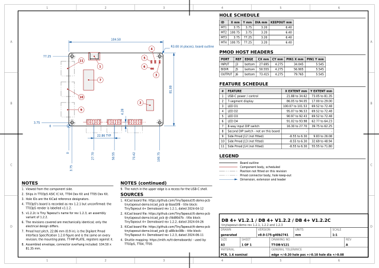</a><br>
<b>TT-DB-V121</b> DB 4+ v1.2.1 / DB 4+ v1.2.2 / DB 4+ v1.2.2c<br>tinytapeout-demo rev 1.2.1, 1.2.2 and 1.2.3
</td>
<td width="33%" valign="top" align="center">
<a href="tinytapeout/output/tt-demo-board-v2p0p1-v2p1p0.pdf">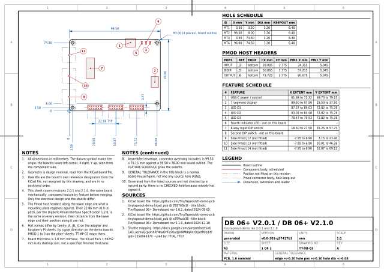</a><br>
<b>TT-DB-V201</b> DB 06+ v2.0.1 / DB 06+ v2.1.0<br>tinytapeout-demo rev 2.0.1 and 2.1.0
</td>
</tr>
<tr>
<td width="33%" valign="top" align="center">
<a href="tinytapeout/output/tt-demo-board-v2p1p2.pdf">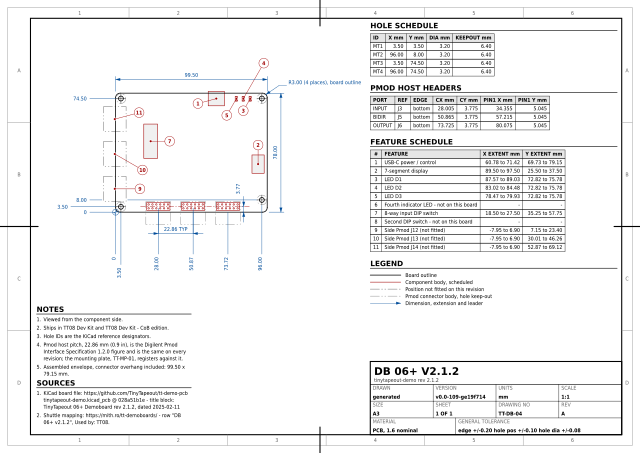</a><br>
<b>TT-DB-V212</b> DB 06+ v2.1.2<br>tinytapeout-demo rev 2.1.2
</td>
<td width="33%" valign="top" align="center">
<a href="tinytapeout/output/tt-demo-board-v3p2.pdf">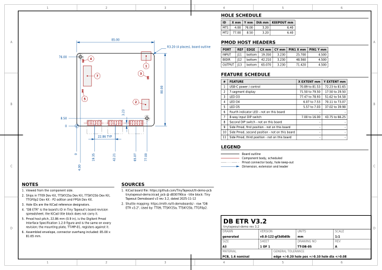</a><br>
<b>TT-DB-V32</b> DB ETR v3.2<br>tinytapeout-demo rev 3.2
</td>
<td width="33%" valign="top" align="center">
<a href="tinytapeout/output/tt-demo-board-v3p3.pdf">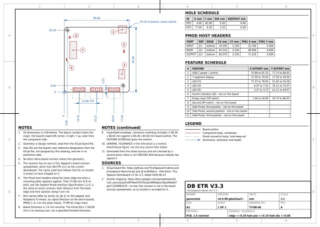</a><br>
<b>TT-DB-V33</b> DB ETR v3.3<br>tinytapeout-demo rev 3.3
</td>
</tr>
</table>

### Raspberry Pi

<table>
<tr>
<td width="33%" valign="top" align="center">
<a href="raspberry_pi/output/rpi3b.pdf">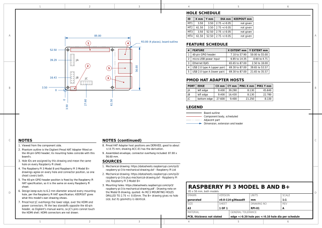</a><br>
<b>RPI-3B</b> Raspberry Pi 3 Model B and B+<br>85 x 56 mm, both models
</td>
<td width="33%" valign="top" align="center">
<a href="raspberry_pi/output/rpi4b.pdf">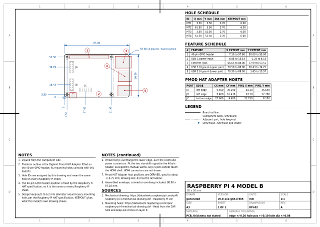</a><br>
<b>RPI-4B</b> Raspberry Pi 4 Model B<br>85 x 56 mm
</td>
<td width="33%" valign="top" align="center">
<a href="raspberry_pi/output/rpi5.pdf">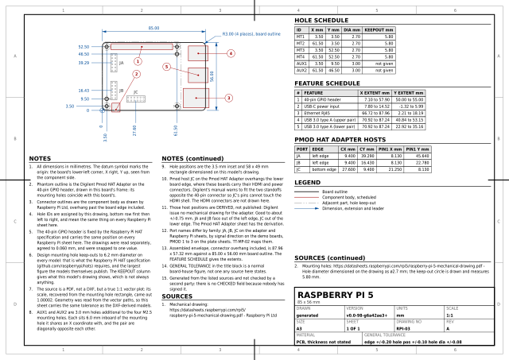</a><br>
<b>RPI-5</b> Raspberry Pi 5<br>85 x 56 mm
</td>
</tr>
<tr>
<td width="33%" valign="top" align="center">
<a href="raspberry_pi/output/rpi-models-compared.pdf">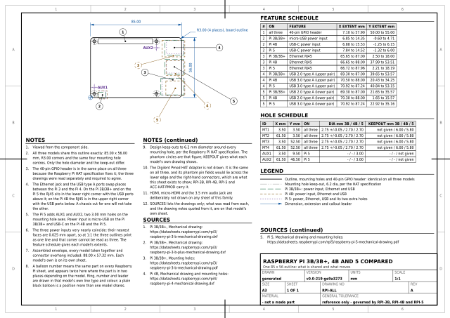</a><br>
<b>RPI-ALL</b> Raspberry Pi 3B/3B+, 4B and 5 compared<br>One 85 x 56 outline: what is shared and what moves
</td>
<td width="33%"></td>
<td width="33%"></td>
</tr>
</table>

### Raspberry Pi camera modules

<table>
<tr>
<td width="33%" valign="top" align="center">
<a href="raspberry_pi_camera/output/cm2.pdf">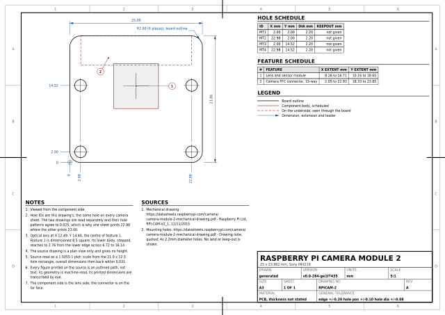</a><br>
<b>RPICAM-2</b> Raspberry Pi Camera Module 2<br>25 x 23.862 mm, Sony IMX219
</td>
<td width="33%" valign="top" align="center">
<a href="raspberry_pi_camera/output/cm3.pdf">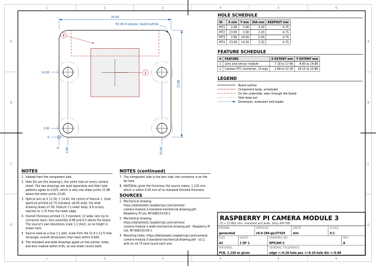</a><br>
<b>RPICAM-3</b> Raspberry Pi Camera Module 3<br>25 x 23.862 mm, standard and wide, Sony IMX708
</td>
<td width="33%"></td>
</tr>
</table>

### FPGA development boards

<table>
<tr>
<td width="33%" valign="top" align="center">
<a href="fpga/output/arty-a7.pdf">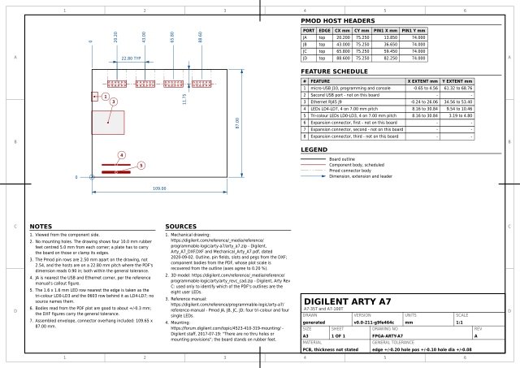</a><br>
<b>FPGA-ARTY-A7</b> Digilent Arty A7<br>A7-35T and A7-100T
</td>
<td width="33%" valign="top" align="center">
<a href="fpga/output/ulx3s.pdf">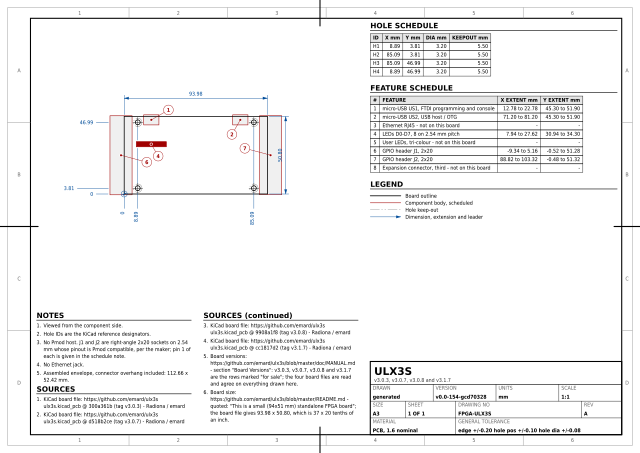</a><br>
<b>FPGA-ULX3S</b> ULX3S<br>v3.0.3, v3.0.7, v3.0.8 and v3.1.7
</td>
<td width="33%" valign="top" align="center">
<a href="fpga/output/pynq-z2.pdf">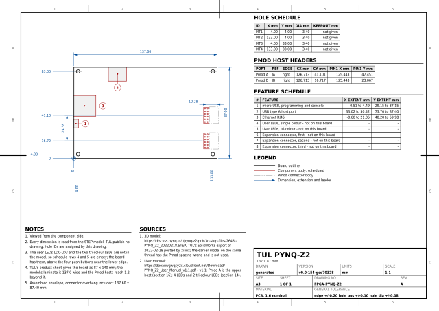</a><br>
<b>FPGA-PYNQ-Z2</b> TUL PYNQ-Z2<br>137 x 87 mm
</td>
</tr>
<tr>
<td width="33%" valign="top" align="center">
<a href="fpga/output/butterstick.pdf">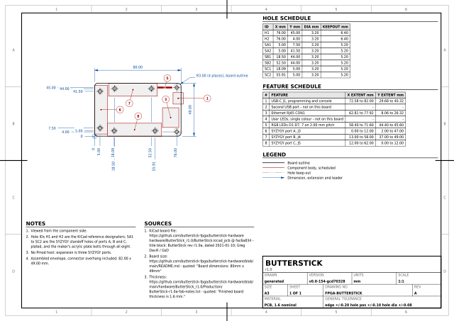</a><br>
<b>FPGA-BUTTERSTICK</b> ButterStick<br>r1.0
</td>
<td width="33%" valign="top" align="center">
<a href="fpga/output/icepi-zero.pdf">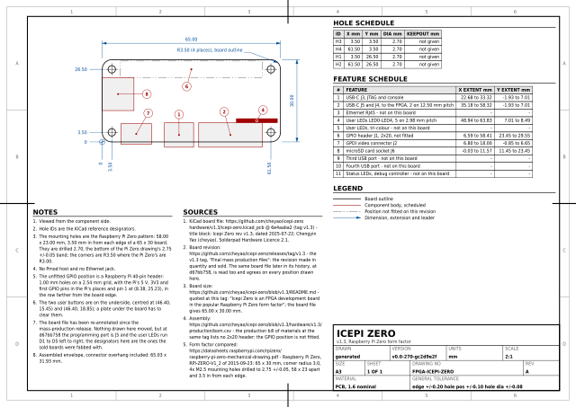</a><br>
<b>FPGA-ICEPI-ZERO</b> Icepi Zero<br>v1.3, Raspberry Pi Zero form factor
</td>
<td width="33%" valign="top" align="center">
<a href="fpga/output/cynthion.pdf">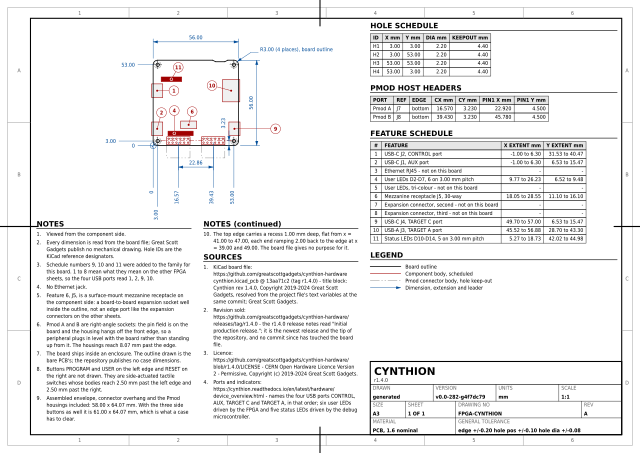</a><br>
<b>FPGA-CYNTHION</b> Cynthion<br>r1.4.0
</td>
</tr>
<tr>
<td width="33%" valign="top" align="center">
<a href="fpga/output/zybo-z7.pdf">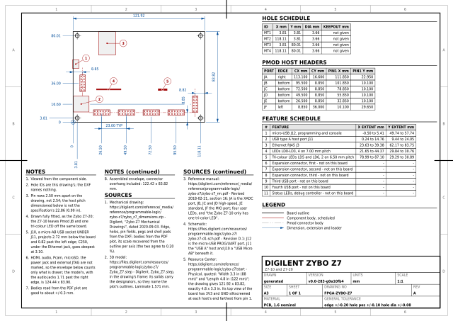</a><br>
<b>FPGA-ZYBO-Z7</b> Digilent Zybo Z7<br>Z7-10 and Z7-20
</td>
<td width="33%" valign="top" align="center">
<a href="fpga/output/ultra96-v2.pdf">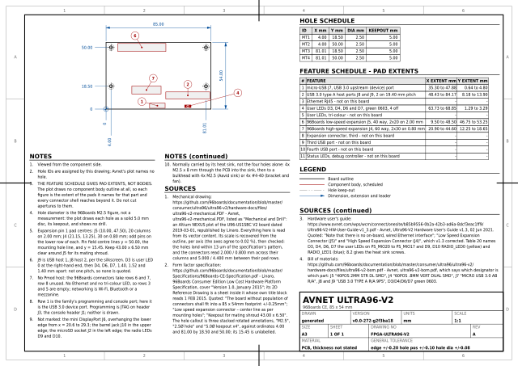</a><br>
<b>FPGA-ULTRA96-V2</b> Avnet Ultra96-V2<br>96Boards CE, 85 x 54 mm
</td>
<td width="33%"></td>
</tr>
</table>

### Arty A7 Ethernet light pipe

<table>
<tr>
<td width="33%" valign="top" align="center">
<a href="fpga/light_pipe/output/arty-ethernet-light-pipe.pdf">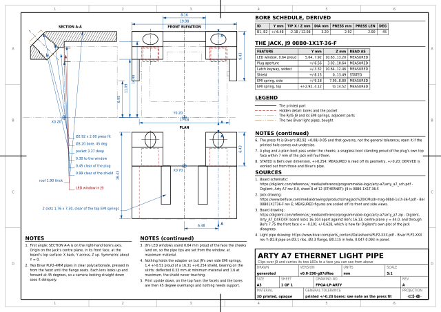</a><br>
<b>FPGA-LP-ARTY</b> Arty A7 Ethernet Light Pipe<br>Clips over J9 and carries its two LEDs to a face you can see from above
</td>
<td width="33%"></td>
<td width="33%"></td>
</tr>
</table>

### Accessories

<table>
<tr>
<td width="33%" valign="top" align="center">
<a href="accessories/output/pmod-hat.pdf"></a><br>
<b>ACC-HAT-PMOD</b> Digilent Pmod HAT Adapter<br>410-366, fitted to a Raspberry Pi 40-pin GPIO header
</td>
<td width="33%" valign="top" align="center">
<a href="accessories/output/poe-usbc.pdf"></a><br>
<b>ACC-POE-USBC</b> Waveshare PoE Splitter 25 W, Type-C<br>POE-SPLITTER-25W-TYPE-C, extruded aluminium body
</td>
<td width="33%" valign="top" align="center">
<a href="accessories/output/poe-microusb.pdf"></a><br>
<b>ACC-POE-MUSB</b> Generic PoE splitter to micro-USB<br>IEEE 802.3af, 5 V output, sealed plastic body
</td>
</tr>
<tr>
<td width="33%" valign="top" align="center">
<a href="accessories/output/raspmod.pdf"></a><br>
<b>ACC-HAT-RMOD</b> Raspmod<br>TT Demoboard To Raspi rev 1.0, silkscreen v1.1: a frontplate for the demoboard's three Pmod hosts
</td>
<td width="33%" valign="top" align="center">
<a href="accessories/output/poe-m2-hat-acorn.pdf">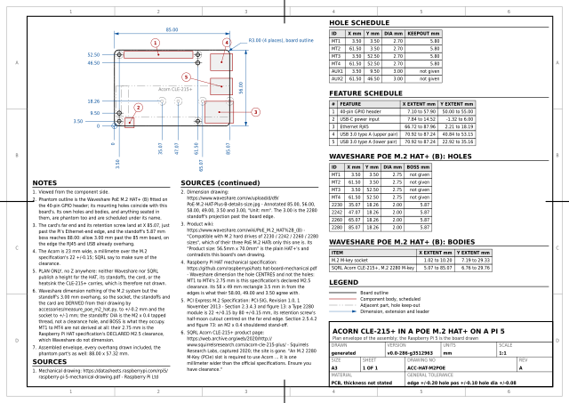</a><br>
<b>ACC-HAT-M2POE</b> Acorn CLE-215+ in a PoE M.2 HAT+ on a Pi 5<br>Plan envelope of the assembly; the Raspberry Pi 5 is the board drawn
</td>
<td width="33%"></td>
</tr>
</table>

### Mounting plate

<table>
<tr>
<td width="50%" valign="top" align="center">
<a href="tinytapeout/mounting_plate/output/tt-generic-mounting-plate.pdf">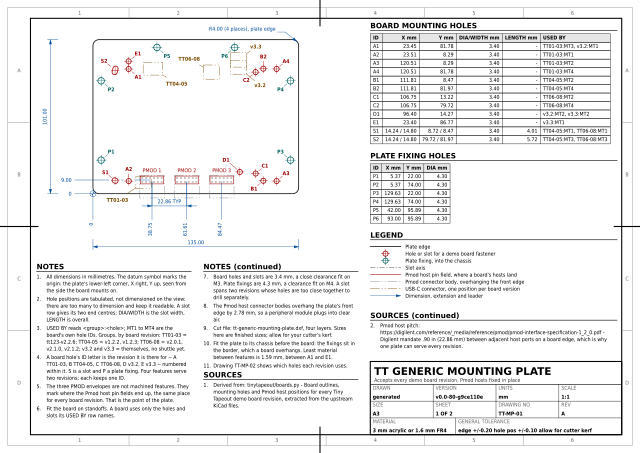</a><br>
<b>TT-MP-PLATE</b> TT Generic Mounting Plate<br>Accepts every demo board revision, Pmod hosts fixed in place
</td>
<td width="50%" valign="top" align="center">
<a href="tinytapeout/mounting_plate/output/tt-generic-mounting-plate-fitting-guide.pdf">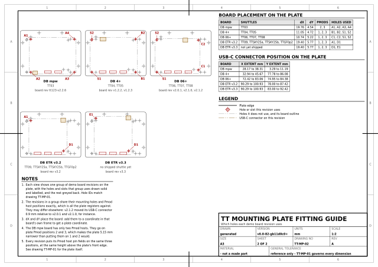</a><br>
<b>TT-MP-FIT</b> TT Mounting Plate Fitting Guide<br>Which holes each demo board revision uses
</td>
</tr>
<tr>
<td width="50%" valign="top" align="center">
<a href="tinytapeout/mounting_plate/output/tt-generic-mounting-plate-drill-template.pdf">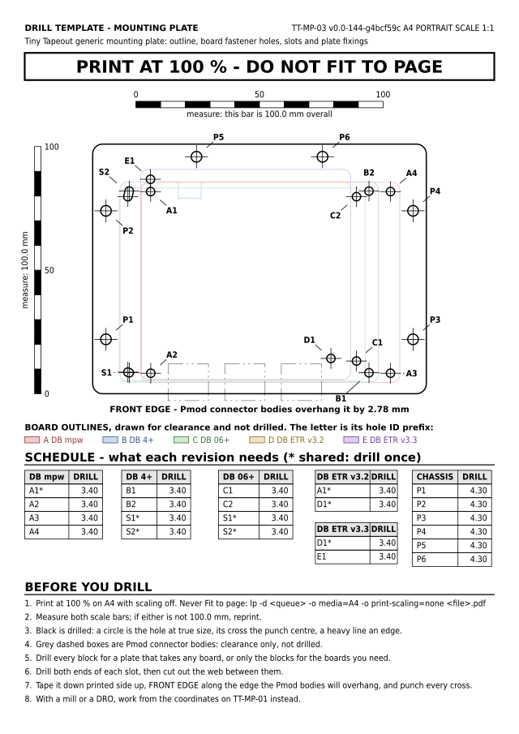</a><br>
<b>TT-MP-DRILL</b> Drill Template: Mounting Plate<br>A4 at 1:1 - print, tape down and drill through
</td>
<td width="50%" valign="top" align="center">
<a href="tinytapeout/mounting_plate/output/tt-generic-mounting-plate-chassis-drill-template.pdf">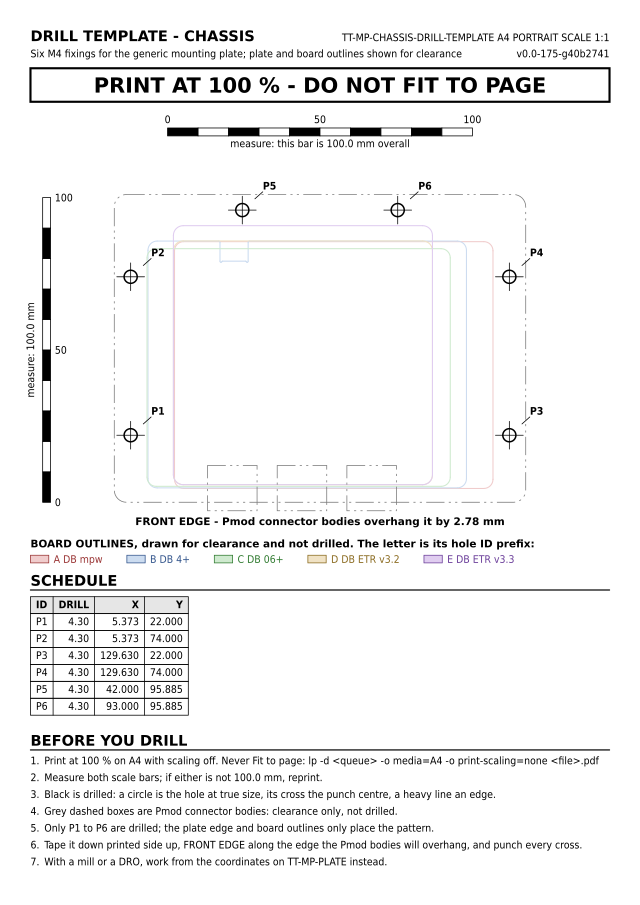</a><br>
<b>TT-MP-CHASSIS</b> Drill Template: Chassis<br>A4 at 1:1 - the six M4 fixings in the box the plate bolts to
</td>
</tr>
</table>

<!-- sheets:end -->

## Printing at true size

Most sheets are 1:1, and any drill template has to be. Print with page scaling
**off** -- choose *Actual size* or *100 %*, never *Fit to page*, or from a
shell:

```sh
lp -d <queue> -o media=A4 -o print-scaling=none \
   tinytapeout/mounting_plate/output/tt-generic-mounting-plate-drill-template.pdf
```

`auto-fit` is the usual default and it shrinks A4 by around 4 %, which moves
the far corner of a hole pattern by millimetres. Every drill template carries a
printed 100 mm scale bar on each axis for exactly this reason: measure them
before drilling. See
[the mounting plate README](tinytapeout/mounting_plate/README.md).

## Regenerating

```sh
make fetch     # download the upstream sources into tmp/, once
make data      # re-extract the mechanical database from them
make check     # render every sheet, refresh the grids, then run the checks
```

Rebuilding is deterministic, and that is checked rather than hoped for: three
full `make clean && make diagrams` cycles produce all 96 output files
byte-identical, so `git status` is silent after a rebuild unless a drawing
actually changed. (On a branch that has added a sheet, that silence returns
only once the whole set has been restamped with the new `VERSION`, which is
one change made on its own rather than a side effect of adding a drawing.)
Cairo, pypdf and ezdxf all stamp a clock, cairo, Inkscape and pypdf their
names and versions, and ezdxf two random GUIDs into what they write;
`tools/reproducible.py` pins all of it. That is what lets a second machine
reproduce the set: Inkscape 1.4 and 1.4.3 on the same cairo draw identical
content and differed only in the version string.

That holds across days as well as within one. Each title block carries a
`VERSION` -- `git describe` of the last commit that changed anything outside an
`output/` directory -- where a render date used to be. A date meant every sheet
in the repository changed whenever anyone rebuilt on a new morning, and it
never answered the question a reader actually has, which is which version of
the data the drawing was made from. A `+` on the end means it was rendered
with uncommitted changes.

Eight checks run over the output and each has caught a real defect, from text
colliding on a sheet to a mounting hole no M3 screw actually fits.
[`tools/README.md`](tools/README.md) says what each one does and what it
found.

## Licence

Apache 2.0; see [`LICENSE`](LICENSE). The upstream sources these drawings are
derived from keep their own licences: the Tiny Tapeout board files are Apache
2.0, the Raspberry Pi board and camera mechanical drawings are Raspberry Pi
Ltd's, the Arty A7 drawing and schematic are Digilent's, the RJ45 drawing is
Bel's, the light pipe drawing is Bivar's, the PYNQ-Z2 model is TUL's, the
Icepi Zero board files are under the Solderpad Hardware Licence 2.1, the
Cynthion board file is Great Scott Gadgets' under the CERN-OHL-P v2, the ULX3S
and ButterStick board files carry their makers' open hardware licences, and
the Ultra96-V2 drawing is Avnet's, republished by Linaro with the 96Boards
Consumer Edition specification.
