# Board mechanical diagrams

2D orthographic (blueprint style) mechanical drawings of the Tiny Tapeout demo
boards, the Raspberry Pi boards they are usually paired with, a couple of PoE
splitters, and a generic mounting plate that any Tiny Tapeout demo board
revision bolts onto.

The drawings are meant for designing things the boards mount into: plates,
brackets, enclosures. Every dimension is traceable to an official source, and
each sheet lists its sources.

## What is here

| Directory | Contents |
|-----------|----------|
| `diagrams/tinytapeout/` | 6 sheets, one per distinct demo board geometry |
| `diagrams/raspberry-pi/` | 3 sheets: Pi 3B/3B+, 4B, 5, each with a Digilent Pmod HAT Adapter overlaid |
| `diagrams/accessories/` | Pmod HAT Adapter, and two PoE splitters as three-view envelope drawings |
| `diagrams/mounting-plate/` | The generic mounting plate: fabrication drawing, fitting guide and two A4 drill templates |
| `diagrams/previews/` | Small renders of every sheet, for the grid below |
| `data/` | The mechanical database. Two modules are generated; the rest is hand-curated with per-value provenance |
| `scripts/` | Extractors, the plate designer, and the generator |
| `drafting/` | A small 2D drafting library that renders a `BoardSpec` as an ISO-style sheet |

Each sheet is written as SVG, PDF and PNG, plus a small preview. A3 and
mostly 1:1, so a print can be laid on the board; the two drill templates are
A4 portrait and always 1:1.

## The sheets

<!-- sheets:begin -->

Each thumbnail links to the PDF. The same sheet is also there as SVG and as
a full-resolution PNG.

### Tiny Tapeout demo boards

<table>
<tr>
<td width="33%" valign="top" align="center">
<a href="diagrams/tinytapeout/tt-demo-board-tt123-v2p2p6.pdf">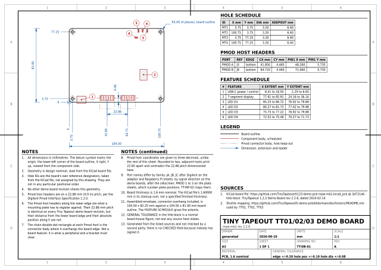</a><br>
<b>TT-DB-01</b> Tiny Tapeout TT01/02/03 Demo Board<br>mpw-mb1 rev 2.2.6
</td>
<td width="33%" valign="top" align="center">
<a href="diagrams/tinytapeout/tt-demo-board-v1p2p2-v1p2p3.pdf">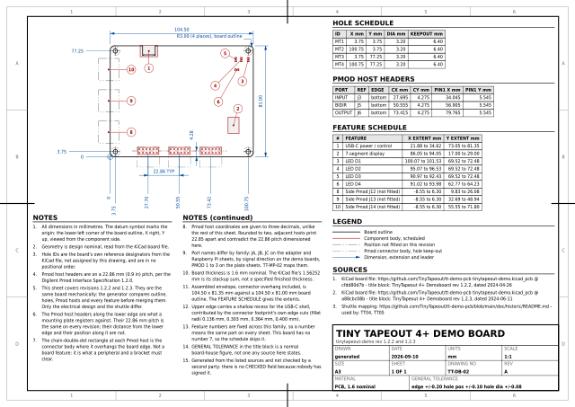</a><br>
<b>TT-DB-02</b> Tiny Tapeout 4+ Demo Board<br>tinytapeout-demo rev 1.2.2 and 1.2.3
</td>
<td width="33%" valign="top" align="center">
<a href="diagrams/tinytapeout/tt-demo-board-v2p0p1-v2p1p0.pdf">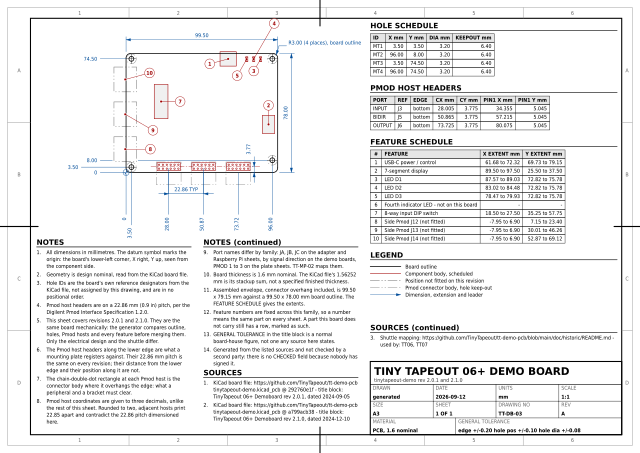</a><br>
<b>TT-DB-03</b> Tiny Tapeout 06+ Demo Board<br>tinytapeout-demo rev 2.0.1 and 2.1.0
</td>
</tr>
<tr>
<td width="33%" valign="top" align="center">
<a href="diagrams/tinytapeout/tt-demo-board-v2p1p2.pdf">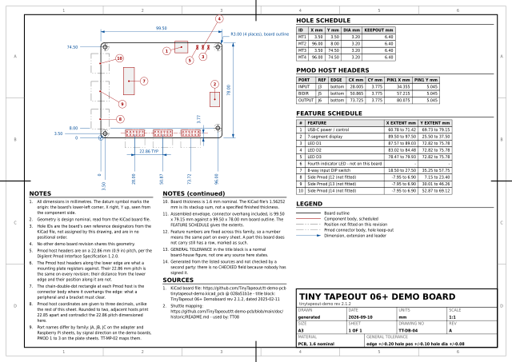</a><br>
<b>TT-DB-04</b> Tiny Tapeout 06+ Demo Board<br>tinytapeout-demo rev 2.1.2
</td>
<td width="33%" valign="top" align="center">
<a href="diagrams/tinytapeout/tt-demo-board-v3p2.pdf">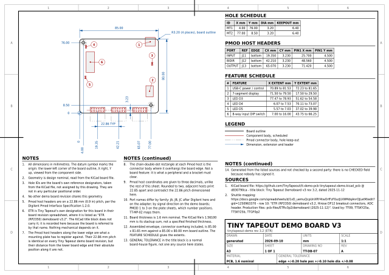</a><br>
<b>TT-DB-05</b> Tiny Tapeout Demo Board v3<br>tinytapeout-demo rev 3.2 (ETR)
</td>
<td width="33%" valign="top" align="center">
<a href="diagrams/tinytapeout/tt-demo-board-v3p3.pdf">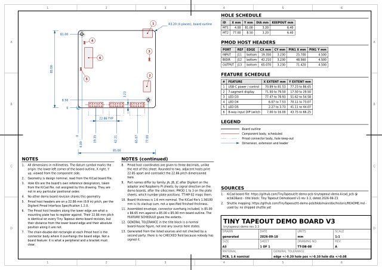</a><br>
<b>TT-DB-06</b> Tiny Tapeout Demo Board v3<br>tinytapeout-demo rev 3.3
</td>
</tr>
</table>

### Raspberry Pi, with a Digilent Pmod HAT Adapter overlaid

<table>
<tr>
<td width="33%" valign="top" align="center">
<a href="diagrams/raspberry-pi/rpi3b.pdf">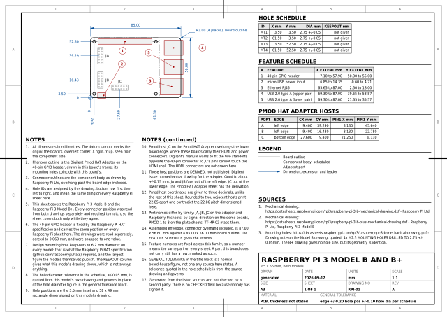</a><br>
<b>RPI-01</b> Raspberry Pi 3 Model B and B+<br>85 x 56 mm, both models
</td>
<td width="33%" valign="top" align="center">
<a href="diagrams/raspberry-pi/rpi4b.pdf">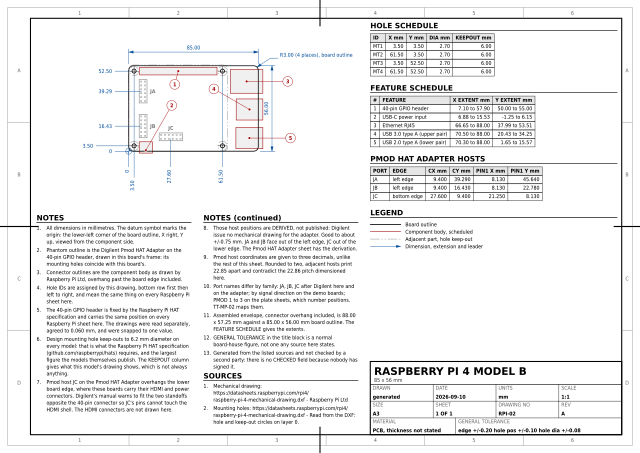</a><br>
<b>RPI-02</b> Raspberry Pi 4 Model B<br>85 x 56 mm
</td>
<td width="33%" valign="top" align="center">
<a href="diagrams/raspberry-pi/rpi5.pdf">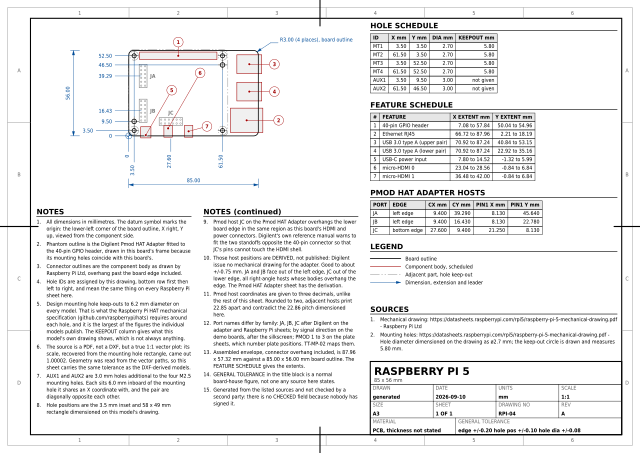</a><br>
<b>RPI-03</b> Raspberry Pi 5<br>85 x 56 mm
</td>
</tr>
</table>

### Accessories

<table>
<tr>
<td width="33%" valign="top" align="center">
<a href="diagrams/accessories/digilent-pmod-hat-adapter.pdf">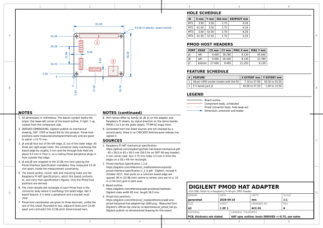</a><br>
<b>ACC-01</b> Digilent Pmod HAT Adapter<br>410-366, fitted to a Raspberry Pi 40-pin GPIO header
</td>
<td width="33%" valign="top" align="center">
<a href="diagrams/accessories/waveshare-poe-usbc.pdf">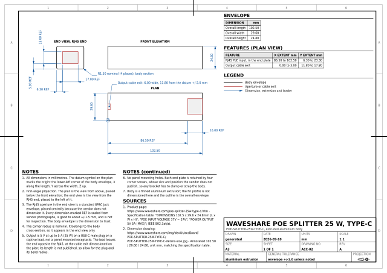</a><br>
<b>ACC-02</b> Waveshare PoE Splitter 25 W, Type-C<br>POE-SPLITTER-25W-TYPE-C, extruded aluminium body
</td>
<td width="33%" valign="top" align="center">
<a href="diagrams/accessories/generic-poe-microusb.pdf"></a><br>
<b>ACC-03</b> Generic PoE splitter to micro-USB<br>IEEE 802.3af, 5 V output, sealed plastic body
</td>
</tr>
</table>

### Mounting plate

<table>
<tr>
<td width="33%" valign="top" align="center">
<a href="diagrams/mounting-plate/tt-generic-mounting-plate.pdf">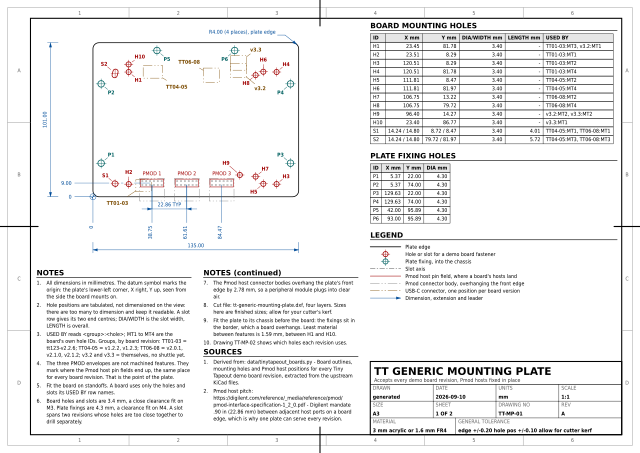</a><br>
<b>TT-MP-01</b> TT Generic Mounting Plate<br>Accepts every demo board revision, Pmod hosts fixed in place
</td>
<td width="33%" valign="top" align="center">
<a href="diagrams/mounting-plate/tt-generic-mounting-plate-fitting-guide.pdf">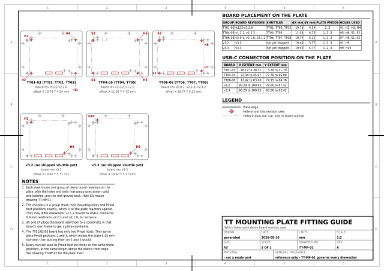</a><br>
<b>TT-MP-02</b> TT Mounting Plate Fitting Guide<br>Which holes each demo board revision uses
</td>
<td width="33%" valign="top" align="center">
<a href="diagrams/mounting-plate/tt-generic-mounting-plate-drill-template.pdf">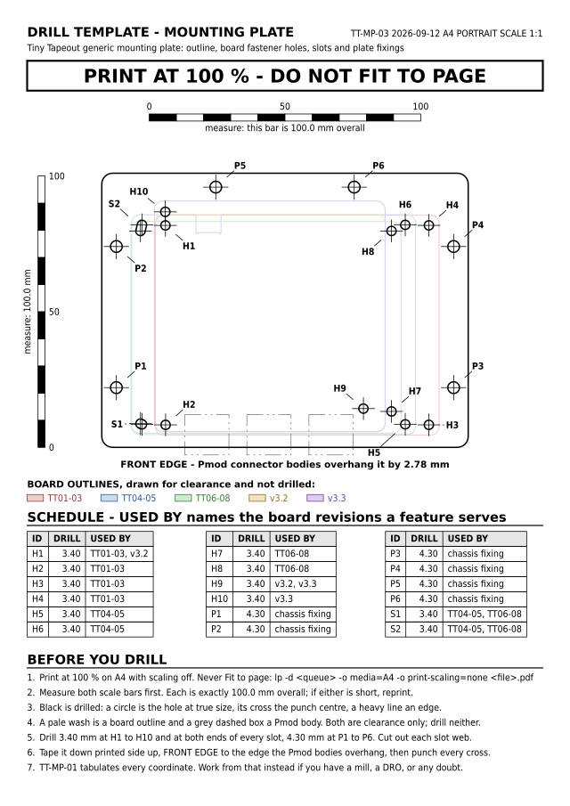</a><br>
<b>TT-MP-03</b> Drill Template: Mounting Plate<br>A4 at 1:1 - print, tape down and drill through
</td>
</tr>
<tr>
<td width="33%" valign="top" align="center">
<a href="diagrams/mounting-plate/tt-generic-mounting-plate-chassis-drill-template.pdf">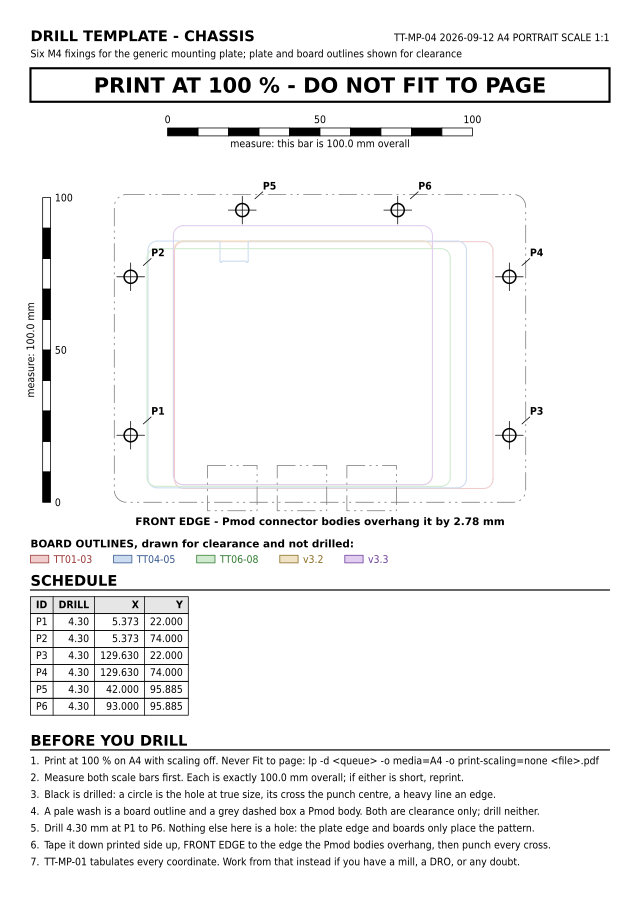</a><br>
<b>TT-MP-04</b> Drill Template: Chassis<br>A4 at 1:1 - the six M4 fixings in the box the plate bolts to
</td>
<td width="33%"></td>
<td width="33%"></td>
</tr>
</table>

<!-- sheets:end -->

## Regenerating

```sh
make fetch     # download the upstream sources into tmp/, once
make data      # re-extract the mechanical database from them
make check     # render every sheet, refresh the grid, then run the checks
```

Rebuilding is deterministic: re-running the whole pipeline leaves the SVGs,
PNGs and data modules byte-identical. Only the PDFs and the DXF change, because
both formats embed a creation timestamp.

Six checks run over the output, and each has caught a real defect:

- `check_sheets.py` re-reads the generated SVGs, recomputes every text bounding
  box from the same font metrics the layout used, and reports text that
  collides, has a line running through it, falls outside the frame, or drops
  below the 2.5 mm ISO 3098 floor. It also checks that every sheet appears in
  the preview grid in this file and that every reference in it resolves, so
  adding a sheet cannot silently leave the grid showing the wrong set. It
  found the notes block printing over the
  sources heading on four Raspberry Pi sheets, a datum leader running back
  through its own text, and overall dimension extension lines crossing the
  ordinate labels.
- `crosscheck_gerber.py` compares an extracted board outline against the
  upstream Edge_Cuts gerber, which KiCad's own plotter produced from the same
  board file. Both give 104.500 x 81.000 mm for the TT01/02/03 board, so the
  parsing and coordinate path is confirmed against something that did not come
  from this repository. Needs network, so it is not part of `make`.
- `verify_mounting_plate.py` proves the plate does what it claims, from the
  data rather than from the drawing: every revision's fasteners pass an M3,
  every Pmod host lands exactly on its plate position, no board overhangs, and
  the connector faces clear the front edge. It found that two revisions wanting
  a fastener 0.613 mm apart had been merged into one 3.40 mm hole, which no M3
  screw actually fits.
- `check_balloons.py` looks one level below the finished SVG, at the obstacle
  model the balloon placer works from, and reports every leader whose final
  route crosses something a reader cannot afford to have a line ruled over: a
  phantom Pmod host, another balloon, another leader, an ordinate witness line.
  It found that a Pmod host's two-letter label was reserving the whole height
  of its pin field, which walled off the diagonal every leader from the
  lower-left corner of a Raspberry Pi wanted to take. Two crossings remain, and
  the script says why: on the Pi 4B and Pi 5 the micro-HDMI connectors sit
  directly beneath host JC, so a leader from them crosses the host whichever
  way it leaves.
- `check_drill_template.py` measures the drill template PDFs instead of
  trusting them. It reads each page back, finds every hole as a circle, and
  compares where it landed against the plate data that drew it; it also checks
  both scale bars really are 100 mm and that nothing strays into the border the
  printer cannot reach. Rendering an SVG guarantees none of this: a different
  exporter or a page sized in points would pass every other check here and put
  the holes 4 % out. Fed a page scaled by the queue's own auto-fit factor it
  reports five problems and finds no holes at all.
- `check_pdfs.py` checks what is actually committed, because the PDFs are the
  artefact: someone who clones this gets them without installing Inkscape, a
  font or `uv`. For every committed sheet it confirms a PDF is committed
  beside it, that the PDF is a render of the committed SVG rather than of some
  earlier one, that the page is the size the drawing claims so it prints 1:1,
  and that no font is embedded, since Inkscape is asked for text as paths and
  a substituted face would letter the sheet at the wrong width. It compares
  git blobs rather than the working tree, which `make diagrams` has just
  rewritten and which would therefore agree with itself whatever was
  committed. The page content stream is what is compared: PDFs embed a
  creation timestamp, so the files differ on every rebuild and the drawing
  inside them does not.

## Printing the drill templates

`TT-MP-03` and `TT-MP-04` are not drawings to read, they are gauges to use:
print, tape to the work, punch every cross, drill through. That only works if
the page leaves the printer at exactly 1:1, and no print dialog does that by
default. A CUPS queue reports what it will do to the page:

```console
$ lpoptions -p WellandColor -l | grep print-scaling
print-scaling/Print Scaling: auto *auto-fit fill fit none
```

`auto-fit` is the default, and it shrinks A4 to whatever the hardware can
actually reach. The same queue reports a 4.32 mm border on all four edges, so
auto-fit scales the page by `min(201.36/210, 288.36/297)` = 0.9588 and moves
the far corner of the hole pattern by 5.6 mm. Print with scaling off:

```sh
lp -d WellandColor -o media=A4 -o print-scaling=none \
   diagrams/mounting-plate/tt-generic-mounting-plate-drill-template.pdf
```

From a viewer, choose **Actual size** or **100 %**, never Fit to page or
Shrink to fit. Then measure the two printed scale bars before drilling
anything: each is 100.0 mm overall, and there are two of them because a laser
fuser shrinks paper along the feed direction, which scales the two axes by
different amounts that a single bar cannot see.

Everything drilled is printed in black and nothing else is. A colour laser
registers its planes to a few tenths of a millimetre, which is more than the
clearance being worked to, so a hole circle and its punch cross are kept in
the one plane that cannot misregister against itself. The pale washes are
board outlines and the grey dashed boxes are Pmod connector bodies: clearance,
not features.

## How the numbers were obtained

The rule throughout: **machine-read the numbers, hand-curate the
identification**. Each extractor carries a small table saying which reference
designator, or which approximate position and size, corresponds to which
mechanical role. If a source changes, the selector stops matching and the
script fails, rather than quietly emitting a wrong dimension.

- **Tiny Tapeout**: read straight out of the upstream KiCad board files, at the
  commit each shuttle was produced from. Board outline, mounting holes, Pmod
  host pin fields, USB connector, seven-segment display and LEDs.
- **Raspberry Pi**: from Raspberry Pi Ltd's own drawings. The Pi 3B, 3B+ and 4B
  have layered DXF; the Pi 5 is a vector PDF whose plot scale is recovered from
  the mounting hole rectangle and checked to be 1:1 rather than assumed.
- **Digilent Pmod HAT Adapter**: Digilent publish no mechanical drawing, DXF,
  STEP or board file for it. The three Pmod host positions were measured
  photogrammetrically from Digilent's own top view, with scale and origin set
  by the four HAT mounting screws, and are quoted at +/-0.75 mm. The fit is
  checked against the 2.54 mm pin pitch, which is what sets that error bar.
- **PoE splitters**: Waveshare publish a dimensioned image. The generic
  AliExpress part has no single authority, so the envelope drawn is the larger
  of two independent body figures and the sheet says so.

## The mounting plate

Every Tiny Tapeout demo board revision, TT01 through v3.3, spaces its Pmod host
headers 22.86 mm apart, because the Digilent Pmod Interface Specification
mandates that pitch for host ports on a board edge. Nothing else about the
boards stayed still: the outline went 104.5 x 81 to 99.5 x 78 to 85 x 85, the
mounting hole pattern changed three times and dropped from four holes to two,
and the distance from the front edge to the Pmod pin field moved from 4.465 mm
to 3.23 mm.

That one invariant is enough. Place each revision so its Pmod hosts land on a
common 22.86 mm grid, and its mounting holes fall where they fall. Eleven holes
and one slot cover all five distinct geometries on a 135 x 101 mm plate.

## Conventions

All sheets use the same frame: origin at the lower-left corner of the part, X
right, Y up, viewed from the component side, millimetres. Holes and Pmod
positions are ordinate dimensions from that single datum, so they neither
accumulate tolerance nor overlap on the sheet, and each witness line starts at
the feature it dimensions.

Sheet layout: the view sits top-left with its dimensions below and to the left;
schedules go in the right-hand column; notes and sources flow into a band
across the bottom, plus whatever is left at the foot of the column. Balloons
are placed inside the view against an obstacle list, so a leader is never
routed through a neighbouring feature.

Text is sized by ISO 3098 character height, not by font em. Nothing is smaller
than 2.5 mm capitals, which is 3.43 mm of font size for these faces. Long hole
schedules are tabulated rather than dimensioned individually, which is standard
once a part has more than a handful of holes.

The general tolerance lives in the title block, where a real drawing puts it
and where it cannot be the note that gets dropped for space.

## Licence

Apache 2.0. The upstream sources it draws from keep their own licences: the
Tiny Tapeout board files are Apache 2.0, and the Raspberry Pi drawings are
Raspberry Pi Ltd's.
