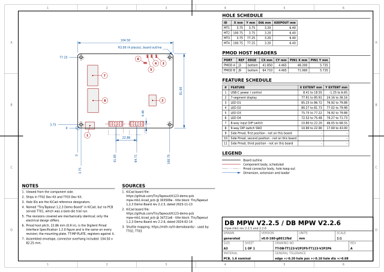
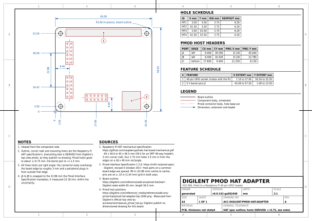
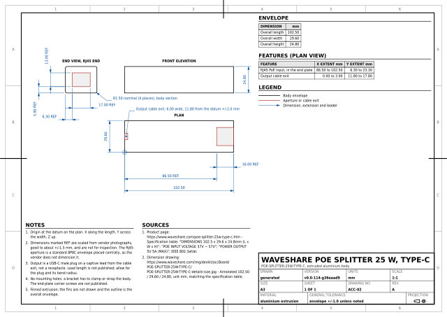
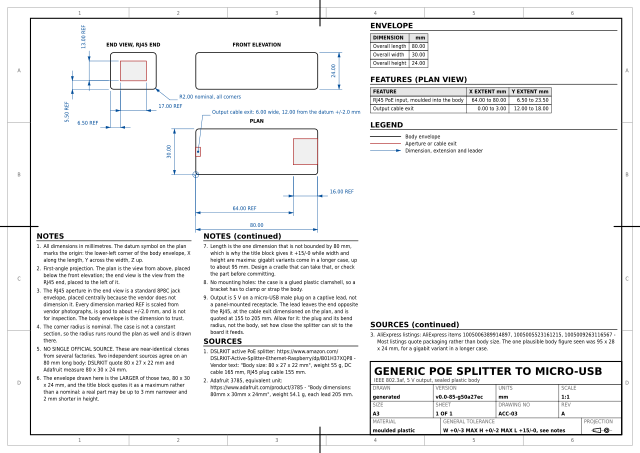

# Mechanical diagrams

2D orthographic (blueprint style) mechanical drawings of the hardware
[fpgas.online](https://fpgas.online) is built from: the boards, the adapters
and the accessories that end up in the same rack, plus the plates and
templates made to mount them.

The drawings are for designing the things the boards mount into -- plates,
brackets, enclosures, rack shelves. Every dimension is traceable to an
official source, and each sheet lists its sources.

Adding hardware is the normal case. Each family lives in its own directory
with its data, the extractor that produces it and the sheets rendered from
it, so a new board is a new directory and does not disturb the others.

## What is here

| Directory | Sheets | |
|-----------|--------|--|
| [`tinytapeout/`](tinytapeout/README.md) | `TT-DB-01`..`06` | Tiny Tapeout demo boards, one sheet per distinct geometry |
| [`tinytapeout/mounting_plate/`](tinytapeout/mounting_plate/README.md) | `TT-MP-01`..`04` | The plate every demo board revision bolts onto, and its drill templates |
| [`raspberry_pi/`](raspberry_pi/README.md) | `RPI-01`..`03` | Pi 3B/3B+, 4B and 5, each with a Digilent Pmod HAT Adapter overlaid |
| [`accessories/`](accessories/README.md) | `ACC-01`..`03` | Pmod HAT Adapter, and two PoE splitters as envelope drawings |
| [`tools/`](tools/README.md) | -- | The [drafting library](tools/drafting/README.md), the generator and the checks |

Each sheet is written as SVG and PDF, plus a small preview beside it.
**The PDFs are committed**, so cloning this is enough to print from: no
Inkscape, no font, no `uv`. A3 and mostly 1:1, so a print can be laid on the
board; the drill templates are A4 portrait and always 1:1.

## The sheets

<!-- sheets:begin -->

Each thumbnail links to the PDF. The same sheet is also there as SVG.

### Tiny Tapeout demo boards

<table>
<tr>
<td width="33%" valign="top" align="center">
<a href="tinytapeout/output/tt-demo-board-tt123-v2p2p5-tt123-v2p2p6.pdf"></a><br>
<b>TT-DB-01</b> DB mpw v2.2.5 / DB mpw v2.2.6<br>mpw-mb1 rev 2.2.5 and 2.2.6
</td>
<td width="33%" valign="top" align="center">
<a href="tinytapeout/output/tt-demo-board-v1p2p1-v1p2p2-v1p2p3.pdf"></a><br>
<b>TT-DB-02</b> DB 4+ v1.2.1 / DB 4+ v1.2.2 / DB 4+ v1.2.2c<br>tinytapeout-demo rev 1.2.1, 1.2.2 and 1.2.3
</td>
<td width="33%" valign="top" align="center">
<a href="tinytapeout/output/tt-demo-board-v2p0p1-v2p1p0.pdf"></a><br>
<b>TT-DB-03</b> DB 06+ v2.0.1 / DB 06+ v2.1.0<br>tinytapeout-demo rev 2.0.1 and 2.1.0
</td>
</tr>
<tr>
<td width="33%" valign="top" align="center">
<a href="tinytapeout/output/tt-demo-board-v2p1p2.pdf"></a><br>
<b>TT-DB-04</b> DB 06+ v2.1.2<br>tinytapeout-demo rev 2.1.2
</td>
<td width="33%" valign="top" align="center">
<a href="tinytapeout/output/tt-demo-board-v3p2.pdf"></a><br>
<b>TT-DB-05</b> DB ETR v3.2<br>tinytapeout-demo rev 3.2
</td>
<td width="33%" valign="top" align="center">
<a href="tinytapeout/output/tt-demo-board-v3p3.pdf"></a><br>
<b>TT-DB-06</b> DB ETR v3.3<br>tinytapeout-demo rev 3.3
</td>
</tr>
</table>

### Raspberry Pi, with a Digilent Pmod HAT Adapter overlaid

<table>
<tr>
<td width="33%" valign="top" align="center">
<a href="raspberry_pi/output/rpi3b.pdf"></a><br>
<b>RPI-01</b> Raspberry Pi 3 Model B and B+<br>85 x 56 mm, both models
</td>
<td width="33%" valign="top" align="center">
<a href="raspberry_pi/output/rpi4b.pdf"></a><br>
<b>RPI-02</b> Raspberry Pi 4 Model B<br>85 x 56 mm
</td>
<td width="33%" valign="top" align="center">
<a href="raspberry_pi/output/rpi5.pdf"></a><br>
<b>RPI-03</b> Raspberry Pi 5<br>85 x 56 mm
</td>
</tr>
</table>

### Accessories

<table>
<tr>
<td width="33%" valign="top" align="center">
<a href="accessories/output/digilent-pmod-hat-adapter.pdf"></a><br>
<b>ACC-01</b> Digilent Pmod HAT Adapter<br>410-366, fitted to a Raspberry Pi 40-pin GPIO header
</td>
<td width="33%" valign="top" align="center">
<a href="accessories/output/waveshare-poe-usbc.pdf"></a><br>
<b>ACC-02</b> Waveshare PoE Splitter 25 W, Type-C<br>POE-SPLITTER-25W-TYPE-C, extruded aluminium body
</td>
<td width="33%" valign="top" align="center">
<a href="accessories/output/generic-poe-microusb.pdf"></a><br>
<b>ACC-03</b> Generic PoE splitter to micro-USB<br>IEEE 802.3af, 5 V output, sealed plastic body
</td>
</tr>
</table>

### Mounting plate

<table>
<tr>
<td width="33%" valign="top" align="center">
<a href="tinytapeout/mounting_plate/output/tt-generic-mounting-plate.pdf"></a><br>
<b>TT-MP-01</b> TT Generic Mounting Plate<br>Accepts every demo board revision, Pmod hosts fixed in place
</td>
<td width="33%" valign="top" align="center">
<a href="tinytapeout/mounting_plate/output/tt-generic-mounting-plate-fitting-guide.pdf"></a><br>
<b>TT-MP-02</b> TT Mounting Plate Fitting Guide<br>Which holes each demo board revision uses
</td>
<td width="33%" valign="top" align="center">
<a href="tinytapeout/mounting_plate/output/tt-generic-mounting-plate-drill-template.pdf"></a><br>
<b>TT-MP-03</b> Drill Template: Mounting Plate<br>A4 at 1:1 - print, tape down and drill through
</td>
</tr>
<tr>
<td width="33%" valign="top" align="center">
<a href="tinytapeout/mounting_plate/output/tt-generic-mounting-plate-chassis-drill-template.pdf"></a><br>
<b>TT-MP-04</b> Drill Template: Chassis<br>A4 at 1:1 - the six M4 fixings in the box the plate bolts to
</td>
<td width="33%"></td>
<td width="33%"></td>
</tr>
</table>

<!-- sheets:end -->

## Printing at true size

Most sheets are 1:1, and any drill template has to be. Print with page scaling
**off** -- choose *Actual size* or *100 %*, never *Fit to page*, or from a
shell:

```sh
lp -d <queue> -o media=A4 -o print-scaling=none \
   tinytapeout/mounting_plate/output/tt-generic-mounting-plate-drill-template.pdf
```

`auto-fit` is the usual default and it shrinks A4 by around 4 %, which moves
the far corner of a hole pattern by millimetres. Every drill template carries a
printed 100 mm scale bar on each axis for exactly this reason: measure them
before drilling. See
[the mounting plate README](tinytapeout/mounting_plate/README.md).

## Regenerating

```sh
make fetch     # download the upstream sources into tmp/, once
make data      # re-extract the mechanical database from them
make check     # render every sheet, refresh the grids, then run the checks
```

Rebuilding is deterministic, and that is checked rather than hoped for: three
full `make clean && make diagrams` cycles produce all 65 output files
byte-identical, so `git status` is silent after a rebuild unless a drawing
actually changed. Cairo and ezdxf both stamp a clock and, in ezdxf's case, two
random GUIDs into what they write; `tools/reproducible.py` pins all of it.

That holds across days as well as within one. Each title block carries a
`VERSION` -- `git describe` of the last commit that changed anything outside an
`output/` directory -- where a render date used to be. A date meant every sheet
in the repository changed whenever anyone rebuilt on a new morning, and it
never answered the question a reader actually has, which is which version of
the data the drawing was made from. A `+` on the end means it was rendered
with uncommitted changes.

Six checks run over the output and each has caught a real defect, from text
colliding on a sheet to a mounting hole no M3 screw actually fits.
[`tools/README.md`](tools/README.md) says what each one does and what it
found.

## Licence

Apache 2.0; see [`LICENSE`](LICENSE). The upstream sources these drawings are
derived from keep their own licences: the Tiny Tapeout board files are Apache
2.0, and the Raspberry Pi mechanical drawings are Raspberry Pi Ltd's.
