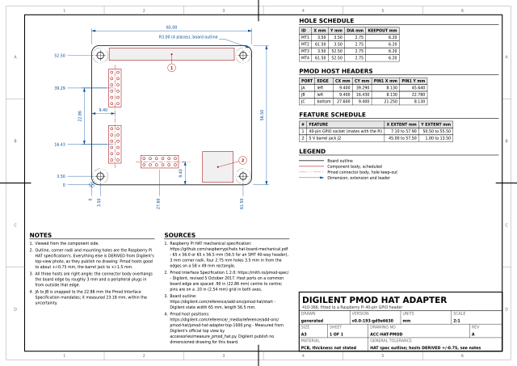
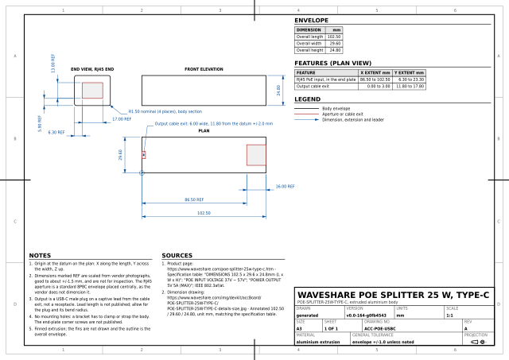
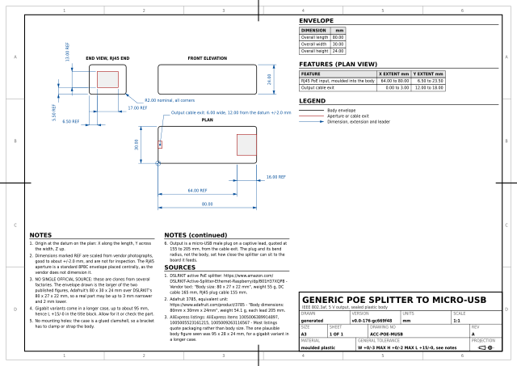
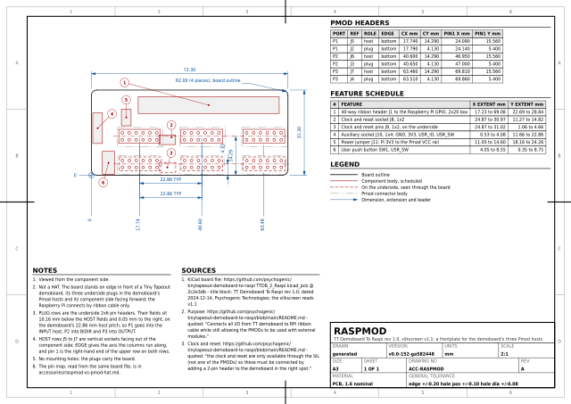

# Accessories

Parts that are neither a Tiny Tapeout board nor a Raspberry Pi, but that turn
up in the same assemblies.

| | |
|---|---|
| `parts.py` | Hand-curated, with per-value provenance: every part here that has no machine-readable source, and the Pmod HAT Adapter's pin map |
| `measure_pmod_hat.py` | Photogrammetry for the Pmod HAT Adapter |
| `raspmod.py` | **Generated.** The Raspmod's geometry and pin map |
| `extract.py` | Reads the Raspmod's KiCad board file and writes `raspmod.py` |
| `compare.py` | Rewrites the tables in `raspmod-vs-pmod-hat.md` from the two data modules |
| [`raspmod-vs-pmod-hat.md`](raspmod-vs-pmod-hat.md) | The two ways of putting Pmods on a Raspberry Pi, compared: pin maps and mechanics |
| `output/` | The `ACC-…` sheets, as SVG and PDF |

`parts.py` is hand-curated because its sources are not machine-readable: a
product photo, a dimensioned marketing image, and a pinout table on a web
page. Every value cites where it came from and, where the figure is a
measurement rather than a published dimension, its error bar. The Raspmod is
the exception: its KiCad board file is published, so `extract.py` reads it
the way the FPGA and Tiny Tapeout extractors read theirs.

```sh
uv run --no-project python accessories/extract.py      # needs tmp/src, see make fetch
uv run --no-project python accessories/compare.py
```

A sheet's file is named for what the part is, and the title block says who
makes it and what its part number is. `ACC_STEMS` in
[`tools/layout.py`](../tools/layout.py) maps each part key to its stem, and
what that drops differs by part: the two PoE splitters' keys name their
vendor, because that is what you buy -- `waveshare-poe-usbc` becomes
`output/poe-usbc.pdf`. The adapter's key never did: it is `pmod-hat-adapter`,
and `digilent-` was put in front of it by hand when the file name was written,
which is where the old `ACC-DIGILENT-PMOD-HAT-ADAPTER` came from. The
Raspmod's key is already what the thing is called.

The drawing name is not that stem in capitals. A drawing number is quoted in
notes, on orders and out loud, so `ACC_NAMES`, beside `ACC_STEMS`, gives each
stem a name of two short words: the kind of part, then which one of that kind.
`pmod-hat` is `ACC-HAT-PMOD` and `raspmod` is `ACC-HAT-RMOD`, the two ways of
putting Pmod ports on a Raspberry Pi; `poe-usbc` is `ACC-POE-USBC` and
`poe-microusb` is `ACC-POE-MUSB`, the two splitters. A table rather than a
rule, because these stems are words and not codes and nothing mechanical
shortens `raspmod` to four characters that still say which board it is. HAT is
Digilent's own word for its adapter; the Raspmod is filed under it as the
other way of doing the same job, though it is
[not a HAT](raspmod-vs-pmod-hat.md) in the specification's sense and reaches
the Pi over a ribbon cable.

## The sheets

<!-- sheets:begin -->

Each thumbnail links to the PDF. The same sheet is also there as SVG.

<table>
<tr>
<td width="33%" valign="top" align="center">
<a href="output/pmod-hat.pdf"></a><br>
<b>ACC-HAT-PMOD</b> Digilent Pmod HAT Adapter<br>410-366, fitted to a Raspberry Pi 40-pin GPIO header
</td>
<td width="33%" valign="top" align="center">
<a href="output/poe-usbc.pdf"></a><br>
<b>ACC-POE-USBC</b> Waveshare PoE Splitter 25 W, Type-C<br>POE-SPLITTER-25W-TYPE-C, extruded aluminium body
</td>
<td width="33%" valign="top" align="center">
<a href="output/poe-microusb.pdf"></a><br>
<b>ACC-POE-MUSB</b> Generic PoE splitter to micro-USB<br>IEEE 802.3af, 5 V output, sealed plastic body
</td>
</tr>
<tr>
<td width="33%" valign="top" align="center">
<a href="output/raspmod.pdf"></a><br>
<b>ACC-HAT-RMOD</b> Raspmod<br>TT Demoboard To Raspi rev 1.0, silkscreen v1.1: a frontplate for the demoboard's three Pmod hosts
</td>
<td width="33%"></td>
<td width="33%"></td>
</tr>
</table>

<!-- sheets:end -->

## Digilent Pmod HAT Adapter (`ACC-HAT-PMOD`)

Digilent publish no mechanical drawing, DXF, STEP or board file for this part.
The three Pmod host positions were measured photogrammetrically from
Digilent's own top view, with scale and origin set by the four HAT mounting
screws, and are quoted at **+/-0.75 mm**.

That error bar is not a guess. The fit is checked against something not used
to derive it: the 40-way GPIO header must come out 50.8 mm long at a 2.54 mm
pitch, and the residual on that check is the honest error bar for everything
else measured here.

```sh
uv run --no-project --with pillow --with numpy python \
    accessories/measure_pmod_hat.py tmp/digilent/hat.png
```

## Raspmod (`ACC-HAT-RMOD`)

Pat Deegan's "TT Demoboard To Raspi": not a HAT but a frontplate, whatever its
drawing number says -- the `HAT` there files it with the Digilent adapter it
is an alternative to, not with the specification. Three
2x6 pin headers on its underside go into a Tiny Tapeout demoboard's three
Pmod hosts, three sockets on its front take external Pmods in their place,
and a 2x20 box header carries every signal to a Raspberry Pi over a ribbon
cable. It has no mounting holes; the plugs carry it.

Everything on the sheet is read from the board file at a pinned commit,
including the fact that the plugs sit on the demoboard's 22.86 mm host pitch,
which the extractor checks. The pin map comes from the same file, because
KiCad writes each pad's net into it. Which demoboard it fits, and how it
differs from the Digilent adapter, is in
[`raspmod-vs-pmod-hat.md`](raspmod-vs-pmod-hat.md).

## PoE splitters (`ACC-POE-USBC`, `ACC-POE-MUSB`)

Drawn as three-view envelope drawings, which is what they are useful as: they
go inside a box and what matters is the space they need and where the cable
leaves.

Waveshare publish a dimensioned image for the 25 W PoE to USB-C splitter. The
generic AliExpress PoE to micro-USB part has no single authority, so the
envelope drawn is the larger of two independent body figures, and the sheet
says so rather than presenting a figure it cannot support.
