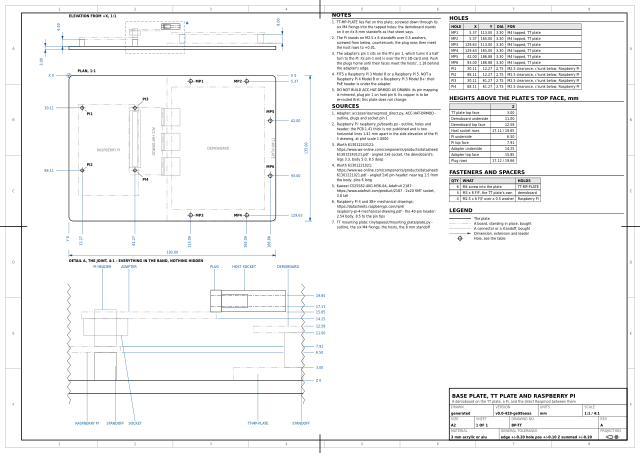
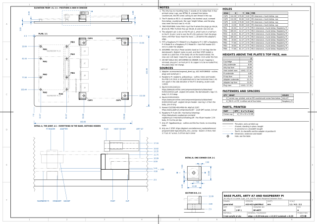

# The base plates

Two plates, each carrying a Raspberry Pi and an FPGA board with the direct
Raspmod ([`ACC-HAT-DRMOD`](../accessories/README.md)) between them: the
adapter sits on the Pi's 40-pin header and its three right-angle plugs go
sideways into the FPGA board's Pmod hosts. What a plate settles is the
height of each board, so that the plugs' pin rows meet the hosts', and the
position of each, so that the plugs meet the hosts; both are worked out
from the data modules and the connectors' datasheets, and each sheet draws
the whole stack in elevation with the standoffs dimensioned.

Both plates are laid out the same way: the Pi at the front (small Y), the
FPGA board behind it, the adapter bridging the two. The Arty goes on a half
turn round for that, since its hosts face off its far edge; nothing on it
cares which way it points. Each sheet is an A2 -- the only ones here -- with
the elevation over the plan at 1:1, and the joint drawn again at 2:1 with
every level dimensioned from the plate's top face.

| | |
|---|---|
| `model.py` | What a plate is made of: the plate as a `BoardSpec`, and everything standing on it as boxes |
| `design.py` | Works out both plates from the adapter, the Pi, the TT plate, the Arty and the connectors, and writes `plates.py` |
| `plates.py` | **Generated.** The two plates |
| `verify.py` | Proves the rows meet, the plugs land on the hosts, nothing on the Pi is in the adapter's way, nothing overlaps, and every hole is where it should be |
| `output/` | `BP-TT` and `BP-ARTY`, as SVG and PDF |

```sh
uv run --no-project --with pdfplumber --with cadquery python base_plates/design.py
uv run --no-project python base_plates/verify.py
```

## The sheets

<!-- sheets:begin -->

Each thumbnail links to the PDF. The same sheet is also there as SVG.

<table>
<tr>
<td width="50%" valign="top" align="center">
<a href="output/tt-pi.pdf"></a><br>
<b>BP-TT</b> Base Plate, TT Plate and Raspberry Pi<br>A demoboard on the TT plate, a Pi, and the direct Raspmod between them
</td>
<td width="50%" valign="top" align="center">
<a href="output/arty-pi.pdf"></a><br>
<b>BP-ARTY</b> Base Plate, Arty A7 and Raspberry Pi<br>An Arty A7 in corner cups, a Pi, and the direct Raspmod between them
</td>
</tr>
</table>

<!-- sheets:end -->

## The stack

From the Pi's top face up: its header body is 2.54 tall, the adapter's
socket 3.8 on it, so the adapter's underside is 6.34 above the Pi and its
top face 7.94. A right-angle 2x6 header on that face has its rows 1.27 and
3.81 higher; a right-angle 2x6 host socket stands its 5.0 body on 3.3 legs,
rows 4.53 and 7.07 above its own board. So the FPGA board's top face has
to be **4.68 above the Pi's**.

`BP-TT` gets there with the TT plate flat on the base plate and the
demoboard on the plate's own 8 mm standoffs, which puts its top face 12.58
up; the Pi on M2.5 x 6 standoffs over 0.5 washers is then 0.01 high. `BP-ARTY`
puts the Pi on M2.5 x 4, the shortest usual, and the Arty -- no holes,
rubber feet -- in four printed corner cups whose height, 4.89, follows.

The Pi's PCB thickness is not something Raspberry Pi Ltd publish; it is
measured off the Pi 5 drawing's 1:1 side elevation as 1.41. The Arty's
thickness (1.5) and its feet (3.7 tall, 8.7 across) come from Digilent's
rev C STEP model, whose Pmod sockets are placeholder boxes: that the Arty's
sockets stand on 3.3 mm legs like the demoboard's Wurth part is an
assumption, stated on the sheet with what to do if it is wrong.

## Which Pi

A Raspberry Pi 5 or 3B. The 3B+ and 4B carry a PoE header 8.5 mm tall
where the adapter sits 6.34 mm up, and the adapter is cut short enough to
clear every model's Ethernet and USB stack; `verify.py` checks both from
the Pi drawings' figures.

## Pin mapping

As drawn, `ACC-HAT-DRMOD` mates its plugs in mirror image with a host's
(pin 1 on pin 6, and the ports reversed): the copper is to be redone before
the board is made. Nothing on these sheets moves when it is -- the plugs'
positions and heights are what the plates are built to.
