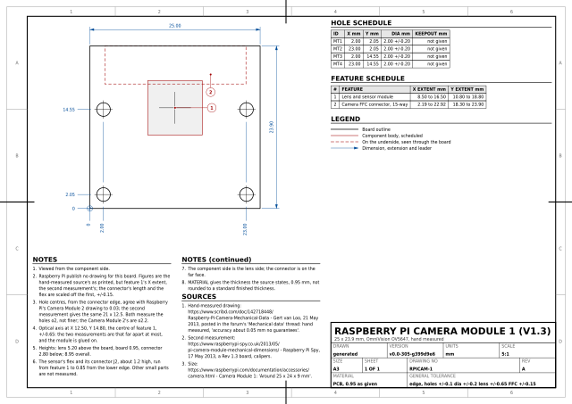

# Raspberry Pi camera modules

The camera boards, drawn for the thing that actually gets designed round them:
a mount with a light path through it. Each board sheet marks the board
outline, the four mounting holes, the lens and sensor module with its optical
axis, and the camera FFC connector on the underside.

The `RPICAM-OVER-*` sheets answer the other half of the same question. Once
the mount exists, how far above the board does it go, and over what point?
One sheet per subject, and each sheet's name says which after `RPICAM-OVER-`:
the Tiny Tapeout mounting plate and the Digilent Arty A7. Each leads with
two elevations, one for each axis of the picture, drawing the subject edge
on, a Camera Module v1.3 over it and the stock 65 degree lens's field of view
reaching the edges of the rectangle the picture has to cover, and
dimensioning how high the lens goes and where; a smaller plan shows the
rectangles over the subject, and the tables give every height for both
lenses. [`TT-MP-CAMERA`](../tinytapeout/camera_holder/README.md) is a
holder built to the first of them.

| | |
|---|---|
| `boards.py` | **Generated.** Camera Module 2, and Camera Module 3 standard and wide; the Camera Module 1 is imported into it from `v1.py` |
| `extract.py` | Reads Raspberry Pi Ltd's own drawings and writes `boards.py` |
| `v1.py` | **Hand-curated**, with per-value provenance: the Camera Module 1, the OV5647 board lettered v1.3, which Raspberry Pi never drew |
| `measure_cm1.py` | Scales what the v1.3's hand-measured drawing draws and does not dimension, and checks the scale |
| `verify.py` | Holds `v1.py` against its cached sources and the checks its error bars rest on |
| `optics.py` | **Hand-written.** The OV5647's sensor, its two lenses and their focus, quoted from the vendors; the framing model; and the subjects a camera is put over |
| `verify_optics.py` | Checks every quote in `optics.py` against the cached page, the model against Raspberry Pi's own figures, each lens's declared pair against the sensor's shape, and every frame against its target, its plane and its height |
| `output/` | The `RPICAM-` sheets, as SVG and PDF, and `raspberry-pi-camera-sheets.pdf`, all of them bound into one document |

```sh
tools/fetch_raspberry_pi_camera.sh                    # once, needs network
uv run --no-project --with pdfplumber python raspberry_pi_camera/extract.py
uv run --no-project --with pdfplumber --with pillow --with numpy \
    python raspberry_pi_camera/verify.py
uv run --no-project --with pillow python raspberry_pi_camera/verify_optics.py
```

## The sheets

<!-- sheets:begin -->

Each thumbnail links to the PDF. The same sheet is also there as SVG.

<table>
<tr>
<td width="33%" valign="top" align="center">
<a href="output/cm1.pdf"></a><br>
<b>RPICAM-1</b> Raspberry Pi Camera Module 1 (v1.3)<br>25 x 23.9 mm, OmniVision OV5647, hand measured
</td>
<td width="33%" valign="top" align="center">
<a href="output/cm2.pdf"></a><br>
<b>RPICAM-2</b> Raspberry Pi Camera Module 2<br>25 x 23.862 mm, Sony IMX219
</td>
<td width="33%" valign="top" align="center">
<a href="output/cm3.pdf"></a><br>
<b>RPICAM-3</b> Raspberry Pi Camera Module 3<br>25 x 23.862 mm, standard and wide, Sony IMX708
</td>
</tr>
</table>

<!-- sheets:end -->

## Where the numbers come from

For the Camera Module 2 and 3, PDFs, all Raspberry Pi Ltd's, all vector,
none of them a DXF:

| Sheet | Drawing | Published |
|---|---|---|
| `RPICAM-2` | [`camera-module-2-mechanical-drawing.pdf`](https://datasheets.raspberrypi.com/camera/camera-module-2-mechanical-drawing.pdf), title block **RASPBERRY PI CAMERA MODULE V2.1**, ref `RPI-CAM-V2_1` | dated 12/11/2015, drawn Mike Stimson, approved James Adams |
| `RPICAM-3` | [`camera-module-3-standard-mechanical-drawing.pdf`](https://datasheets.raspberrypi.com/camera/camera-module-3-standard-mechanical-drawing.pdf), `RP-008153-DS-1` | on the Product Information Portal, [Camera Module 3 design files](https://pip.raspberrypi.com/categories/1207-design-files) |
| `RPICAM-3` | [`camera-module-3-wide-mechanical-drawing.pdf`](https://datasheets.raspberrypi.com/camera/camera-module-3-wide-mechanical-drawing.pdf), `RP-008155-DS-1` | the same place |

For the Camera Module 1, no drawing of Raspberry Pi's at all; `RPICAM-1` is
drawn from a hand measurement instead, and has
[a section of its own](#the-camera-module-1-v13-drawn-without-a-drawing).

## The Camera Module 1, v1.3, drawn without a drawing

The original camera, the 5 megapixel OmniVision OV5647 board, lettered
"Raspberry Pi Camera Rev 1.3" on its lens side and known as the v1.3. It was left out of the set at
first, for a reason that still stands: Raspberry Pi have never published a
mechanical drawing for it. It has no category on the Product Information
Portal, `datasheets.raspberrypi.com/camera/` has never served one, the
archived `raspberrypi.org/documentation/hardware/camera/mechanical/`
directory held the Camera Module 2 and the HQ Camera only, and the
documentation's one figure is "Around 25 × 24 × 9 mm" in a product table.

It is drawn anyway because it is the board most of the hardware here uses,
and because a source for it does exist that is honest about what it is. It is
drawn the way `accessories/parts.py` draws the Pmod HAT Adapter: by hand,
every figure with its provenance, and an error bar that rests on a check the
figures were not used to make. `v1.py` holds it, and `verify.py` holds `v1.py`
to its sources.

It stays in this family rather than going to `accessories/`: the family is
the subject, Raspberry Pi's cameras, and not the method by which a sheet's
numbers were got. The sheet says in its title block that it is hand measured.

### The sources

| | What it is | What it gives |
|---|---|---|
| [Gert van Loo's sheet](https://www.scribd.com/doc/142718448/Raspberry-Pi-Camera-Mechanical-Data) | One page, "Rev 1.0 : 21 May 2013, All sizes in mm, scale 5:1", "Best effort, manually measured, no guarantees!", posted the same day in the Raspberry Pi forum's camera board thread [Mechanical data](https://forums.raspberrypi.com/viewtopic.php?t=44466): "hand measured, accuracy about 0.05 mm no guarantees" | **The primary source.** Plan and elevation, to scale: 25 x 23.9 board, 0.95 thick; four ø2 holes, 9.35 and 21.85 from the connector edge, 2 and 23 up; the 8 mm lens module 5.1 from the connector edge and 5.2 tall; the connector 5.6 deep and 2.8 below the board; the cable 16.2 wide, its upper face 1.27 below the board |
| [Raspberry Pi Spy](https://www.raspberrypi-spy.co.uk/2013/05/pi-camera-module-mechanical-dimensions/) | A Rev 1.3 board measured "using a set of plastic calipers", 17 May 2013, every figure a whole or half millimetre | A second opinion: 25 x 24; holes 21 x 12.5, 2 in from the far edge, "~2mm"; the 8 mm lens module 8.5 in from each side and 5.5 from the connector edge; "approximately 1mm thick"; 6 mm from the board's underside to the lens face |
| [Raspberry Pi's documentation](https://www.raspberrypi.com/documentation/accessories/camera.html) | The camera comparison table | "Around 25 × 24 × 9 mm" |
| [Arducam B0033](https://www.uctronics.com/download/Amazon/B0033.pdf) | A clone's datasheet, sold as "fully compatible with official one" | Nothing drawn here. It agrees about the holes, 21.00 x 12.50, 2.00 in, R=1.00, and disagrees about the lens, printing its centre 10.25 from the edge where the two measurements of the Raspberry Pi board give 9.1 and 9.5 |

`tools/fetch_raspberry_pi_camera.sh` caches all of them, each as a pinned
Wayback Machine capture but for the one page image the Wayback Machine has
no copy of. Gert van Loo's sheet is on Scribd, and Scribd serves its page as
an image with the printed figures in a separate text layer, so both are
fetched: the image to measure, the text layer to check each quoted figure
against. One figure, "5.6", is lettered below where that image is cropped;
the text layer puts it under the connector, and the dashed connector in the
plan view is 5.63 deep, so that is what it is taken to dimension.

### Printed, scaled, and checked

Everything the sheet prints is taken as printed; the lens module's position
across the board, which it draws and does not print, is Raspberry Pi Spy's
printed figure instead, and the drawing puts it within 0.03 of the same
place. What else it draws and never dimensions -- the FFC connector's length
along the edge, where the cable leaves it, the sensor's flex tail and how
high it stands, the steps of the lens stack -- is scaled off it by
`measure_cm1.py`. The drawing says "scale 5:1", and that is checked rather
than trusted: the scale comes from the two overall dimensions, 25 and 23.9,
which agree on it to 0.02 %, and then every other figure the sheet prints is
measured off the drawing and compared. **The worst is 0.09 mm**, the lens
tip, drawn 5.11 against 5.2 printed. Added to Gert's own 0.05, that is the
+/-0.15 the sheet gives everything scaled.

The error bars the sheet quotes rest on checks the figures were not used to
make:

- **The holes, against Raspberry Pi's own drawings.** If the Camera Module
  2 kept the Camera Module 1's hole pattern, Raspberry Pi did draw it after
  all, on the later board. Gert's hand-measured centres, taken from the
  connector edge, agree with the Camera Module 2 drawing to **0.023 mm** and
  the Camera Module 3's to **0.008 mm**, so it did, as closely as a hand
  measurement can say. Measured from the far edge they are 0.05 apart,
  because his board is 23.9 and theirs 23.862. Hole positions and the
  outline carry +/-0.1.
- **The heights, against Raspberry Pi's one figure** -- a sanity check,
  not a tolerance. Lens 5.2 above the board, board 0.95, connector 2.8
  below: **8.95**, against "Around ... 9 mm". Raspberry Pi's table gives the
  Camera Module 2 the same figure, and its Camera Module 3 entries are 0.2
  and 0.4 off that board's own drawings, so it would catch a gross error and
  no fine one. Raspberry Pi Spy's 6 mm from the underside to the lens face
  is 6.15 by Gert's figures.
- **The lens, against a second measurement.** Here the two hand
  measurements disagree: Gert has the module 5.1 from the connector edge,
  Raspberry Pi Spy 5.5, and Raspberry Pi Spy reads to the half millimetre,
  so the two may be as much as 0.65 apart. The module is glued to the board
  -- the same thread: "the camera housing itself is stuck to the board with
  a patch of adhesive and comes off fairly easily" -- and nothing locates
  it, so that spread is not a mistake to resolve but the honest error bar on
  the optical axis, **+/-0.65**. The sheet puts the axis where Gert measured
  it, at X 12.50, Y 14.80, 0.25 above the upper holes; a reader of his sheet
  in the same thread saw the same thing on it, "from the drawing it would
  appear that the lens axis is just off line from the adjacent mounting
  holes", which is a reading of that drawing and not a second measurement.
- **The connector, for information.** Gert draws the body dashed, 19.45
  along the edge, and the connector's face on the edge as a heavy line that
  runs past it at each end, 20.73: the latch ears. The sheet schedules the
  envelope, as the Camera Module 2 sheet does its own; that board's body is
  19.61 and its envelope 20.88 on Raspberry Pi's drawing. Not the same board,
  so not held to anything.

Two things a holder has to know about this board against the Camera Module
2. Its **holes measure ø2**: Gert prints "ø 2" and Raspberry Pi Spy "~2mm",
neither finer, and the clone's drawing agrees, where the Camera Module 2's
are ø2.2 on the same centres. Nothing rules 2.2 out for this board, so the
diameter carries **+/-0.2** of its own. And its **corners are square**, not
R2.0.

### What is not known

Not guessed, and each wants only a board and calipers; `TODO.md` says which
measurement settles which.

- The small parts on the lens side other than the module and the sensor's
  connector J2: Raspberry Pi Spy's photograph shows an LED, D1, and a
  resistor, R9, in the corner by MT1, and neither source dimensions them.
- Anything on the underside but the FFC connector. Gert's elevation draws
  nothing else there, and nothing else says.
- The lens's clear aperture. Gert draws the holder and its tip ring, ø7.5
  and ø5.5 scaled, not the glass.
- The hole diameter to better than the ø2 both sources give.
- The flex tail and J2 are in `v1.py` -- 0.85 from the lower edge to the
  module, about 1.2 high -- but scaled, and not a scheduled feature, for the
  same reason the Camera Module 2 and 3 modules' lower bodies are not: a
  bounding box of a shape that narrows is wrong at its corners.

### For a camera holder

`v1.py` is importable and has at module level what a holder is designed
round: `BOARD_WIDTH`, `BOARD_HEIGHT`, `BOARD_THICKNESS`, `CORNER_RADIUS`,
`HOLES`, `HOLE_DIA`, `OPTICAL_AXIS`, `LENS`, `LENS_PROFILE`, `TAIL`,
`TAIL_TOP_Z`, `FFC` (the envelope) and `FFC_BODY`, `FFC_CABLE` and
`FFC_CABLE_WIDTH`, `FFC_BOTTOM_Z`, `FFC_CABLE_Z`, `TOP_Z`, `BOTTOM_Z` and
`OVERALL_HEIGHT`, and the error bars `HOLE_TOL`, `HOLE_DIA_TOL`, `LENS_TOL`
and `SCALED_TOL`. Plan positions are in this family's
frame, lens side up and connector edge at the top; heights are from the
board's lens-side face, positive toward the lens.

## Neither plot is assumed to be 1:1

A PDF is CAD data only once you know what scale it was plotted at, so the
scale is *recovered* rather than assumed, the way `raspberry_pi/extract.py`
recovers the Pi 5's. Camera Module 3 turns out to be a true 1:1 plot; Camera
Module 2 turns out to be plotted at 1.5055.

The invariant is the mounting hole rectangle: 21 mm apart across the board,
12.5 mm apart up it, the lower pair 2 mm in from two edges. Finding it fixes
the origin, the orientation and the scale at once, and the two overall
dimensions the drawing prints are then required to come back out of it.

| | Recovered plot scale | Outline came back within |
|---|---|---|
| Camera Module 2 | **1.5055 : 1** | 0.031 mm of 25 x 23.862 |
| Camera Module 3 | **1.0000 : 1** | 0.004 mm of 25 x 23.862 |

The Camera Module 2 drawing is half again bigger than the part. A reader who
took the page at face value would get a 37.6 x 35.9 mm camera.

## What is machine-read and what is only printed

The two drawings are not equally readable, and the sheets say so.

- **Camera Module 3** carries its dimension text *as text*, and both
  drawings are checked, each against its own figures. Thirteen are on both --
  `25`, `23.862`, `12.5`, `14.5`, `14.4`, `10.8`, `8.9`, `ø2.2`, `ø4.75`,
  `1.12`, `2.75`, `5.71`, `19.61` -- the standard adds `ø5.75`, `11.3`,
  `6.98`, `66` and `41`, and the wide adds `ø6.95`, `12`, `8.3`, `102` and
  `67`. The comparison is against whole words, not a substring of the page:
  `12` is a figure the wide drawing prints on its own *and* the first half of
  the `12.5` both of them print. A transcription error fails the extraction
  rather than reaching a sheet.
- **Camera Module 2** carries none. `page.chars` is empty: every digit on it
  is a filled path. Its geometry is machine-read exactly as the other's is,
  but its printed dimensions are transcribed by eye, and the sheet carries a
  note saying that.

What was machine-read on each, in board coordinates (origin at the lower-left
corner, X across the 25 mm width, Y up the 23.862 mm height, viewed from the
lens side):

| | Camera Module 2 | Camera Module 3 |
|---|---|---|
| Outline | 25 x 23.862, R2.0 corners | the same |
| Mounting holes | ø2.2 at (2.00, 2.00), (22.98, 2.00), (2.00, 14.52), (22.98, 14.52) | ø2.2 with a ø4.75 land, at (2.00, 2.00), (23.00, 2.00), (2.00, 14.50), (23.00, 14.50) |
| Lens and sensor module | 8.45 x 8.49, centre (12.49, 14.40) | 10.80 x 10.80, centre (12.50, 14.40) |
| Clear aperture | not dimensioned | printed ø5.75 standard, ø6.95 wide; **drawn 5.750 and 7.000** |
| FFC connector, underside | 20.88 x 5.52, from the plan view | 19.61 x 5.71, from the two elevations |
| Board thickness | not stated | 1.12 |
| Height | **not stated anywhere on the drawing** | 11.3 standard, 12 wide, printed |

Raspberry Pi state that "board dimensions and mounting-hole positions for
Camera Module 3 are identical to Camera Module 2"
([camera.html, Advanced information](https://www.raspberrypi.com/documentation/accessories/camera.html)).
That is not taken on trust: each drawing is read on its own and the two hole
patterns compared. **They agree to 0.025 mm**, which is the plot noise of the
1.5:1 source, so the sheets may repeat the claim. The lens module is where the
two boards differ, and by the figures above it grew from 8.5 to 10.8 mm square
without its optical axis moving: 0.01 mm apart on two independent drawings.

## Where these drawings disagree with themselves

Worth knowing before designing to them. The Camera Module 3 drawing's side and
front elevations are 1:1 for the board section (1.120 drawn against 1.12
printed) and for the connector (2.750 against 2.75), but the lens stack is
drawn short: the printed 11.3 mm overall scales 10.08, and 6.98 above the
board scales 5.81. The wide drawing does the same, 12 printed against 10.93
drawn.

It is not only the heights. The **wide drawing's clear aperture is printed
`ø6.95` and drawn 7.000**, while the standard's `ø5.75` is drawn 5.750
exactly; the extractor measures the aperture on each drawing rather than
transcribing it, requires the two to stay within 0.2 mm, and prints both, and
`RPICAM-3` says both numbers. The High Quality Camera drawing does the same
thing again, `ø30.75` scaling 30.42 and `ø22.4` scaling 22.25 while its ø2.5
mounting holes scale 2.500 exactly.

The printed figures are the specification and the sheets quote them as
printed; the sheets do not dimension the height, because there is no view on
them to dimension it on and the source's own geometry would disagree with the
number.

## Where the camera goes

The `RPICAM-OVER-*` sheets. No mechanical drawing carries a field of
view, a focal length or a focus range, so none of this comes off one. Every
figure below is quoted from the vendor that publishes it, and
`verify_optics.py` reads the cached page back and fails if a quote is not in it.

Verbatim quotes below keep the vendor's own characters, degree signs and all;
everything outside them is ASCII, as the rest of this repository is.

### The sensor and the two lenses

Raspberry Pi's camera documentation, Camera Module 1 column
([cached snapshot](https://web.archive.org/web/20241230011811/https://www.raspberrypi.com/documentation/accessories/camera.html)):

| | Quoted |
|---|---|
| Sensor | `OmniVision OV5647` |
| Resolution | `2592 × 1944 pixels` |
| Sensor image area | `3.76 × 2.74 mm` |
| Pixel size | `1.4 µm × 1.4 µm` |
| Focal length | `3.60 mm +/- 0.01` |
| Horizontal field of view | `53.50 +/- 0.13 degrees` |
| Vertical field of view | `41.41 +/- 0.11 degrees` |
| Focus | `Fixed` |
| Depth of field | `Approx 1 m to ∞` |

Arducam's 5MP OV5647 documentation, from the product catalogue table headed
`Field of View(H x V) Focus Type`:

| SKU | Quoted |
|---|---|
| B0033, the standard module | `Stock Lens 54° (H) x 41° (V) Fixed Focus` |
| B006604, a wide one | `120°(H) x 90°(V)`, on an `M6 Lens`, fixed focus |
| B0176, the autofocus one | `54°(H)x44° (V) Auto Focus` |

Neither vendor says **how** the field of view is measured -- to which
rectangle, at what object distance, with or without distortion. That is not
left as a guess, because Raspberry Pi publish enough to settle it.

### The model is checked, not assumed

DERIVED, and checked by `verify_optics.py`:

| | Arithmetic | Result | Declared |
|---|---|---|---|
| Active array | 2592 x 0.0014, 1944 x 0.0014 | 3.6288 x 2.7216 mm, 4:3 exactly | -- |
| Horizontal, from the array | 2 x atan(3.6288 / 2 / 3.60) | **53.496 deg** | 53.50 |
| Vertical, from the array | 2 x atan(2.7216 / 2 / 3.60) | **41.413 deg** | 41.41 |
| Horizontal, from the *image area* | 2 x atan(3.76 / 2 / 3.60) | 55.149 deg | 53.50 |
| Vertical, from the *image area* | 2 x atan(2.74 / 2 / 3.60) | 41.669 deg | 41.41 |

The declared angles come back out of the declared focal length and the
declared pixel count, to four thousandths of a degree on both axes, under a
plain rectilinear pinhole model measured **to the edge of the active pixel
array**. They do not come out of the "sensor image area" printed one row
above in the same table, which misses by 1.65 deg across and 0.26 down. So
the model these sheets use is the vendor's own, and the sheets can say so.
`verify_optics.py` requires the array rows to match and the image-area rows not to.

### Where "65 degrees" comes from

No vendor prints it. It is the diagonal. DERIVED:

| From | Diagonal | |
|---|---|---|
| The image area, sqrt(3.76^2 + 2.74^2) = 4.652 | 2 x atan(4.652 / 2 / 3.60) = **65.74 deg** | which is the 65 |
| The active array, sqrt(3.6288^2 + 2.7216^2) = 4.536 | 2 x atan(4.536 / 2 / 3.60) = 64.42 deg | |

The sheets compute from the horizontal and vertical figures the vendors do
print, and say in a note what the 65 is.

### The 120 degree lens contradicts itself

DERIVED: on a 4:3 sensor a rectilinear lens has tan(V/2) = tan(H/2) x 3/4, so
120 deg across implies **104.82 deg** down, not the 90 deg Arducam declare.
The stock lens passes the same test to 0.01 deg (53.50 gives 41.42 against a
declared 41.41); the wide one is out by nearly fifteen degrees, so the two
figures cannot both be right. The sheets take the height as the greater of
what each declared angle asks for, which is the vertical every time, and say
by how much and on which axis the picture then runs over the rectangle drawn.

### Autofocus is a different part

Arducam's B0176 is an OV5647 with a motorised lens -- "Generally, you can
understand it the same as autofocus" -- and it is not the stock module with a
motor bolted on: its declared field of view is `54°(H)x44° (V)` against the
stock lens's `54° (H) x 41° (V)`, so the optics differ too. It needs a
voice-coil device tree line and gains a close-focus autofocus range; the two
strings Arducam's quick start shows are given there as run-together words in
the rendered page, so the forms to type are on
[that page](https://docs.arducam.com/Raspberry-Pi-Camera/Motorized-Focus-Camera/Quick-Start-Guide/OV5647-Motorized-Focus-Camera/)
rather than transcribed here.

What Arducam do **not** publish for it: a lens height, a focus range in
millimetres, or a minimum object distance. So no height on any of these
sheets is worked out from the autofocus variant. The only published close
limits for any Raspberry Pi camera are on other sensors -- `Approx 10 cm to
∞` for the IMX219 and the IMX708, `Approx 5 cm to ∞` for the IMX708 wide --
and they are quoted to say what order of distance a focusable module reaches,
not as an OV5647 figure.

### The result, and the problem with it

A frame is the smallest rectangle of the sensor's own 4:3, in whichever of
the two orientations is smaller, holding its target plus **5.00 mm on every
side**. Five flat rather than a percentage: what a hand-aimed stand has to
absorb is where the stand ends up, which does not scale with the thing being
framed, and ten per cent round the Arty's LED row would be 0.36 mm, under the
board data's own tolerance.

**Z is measured from the plane the frame's target lies in**, which is not
always the subject's own top face; the column below says which. A stand set
h mm below the right plane covers only (Z - h) / Z of the rectangle at it, so
the error always loses the edges.

| Sheet | Frame | Rectangle, mm | Z from | 65 deg | 120 deg |
|---|---|---|---|--:|--:|
| `RPICAM-OVER-PLATE` | Every board, any revision | 140.27 x 105.20 | the demo board's top face | 139.2 | 52.6 |
| `RPICAM-OVER-PLATE` | Every LED and 7-seg | 100.91 x 75.69 | the demo board's top face | 100.1 | 37.8 |
| `RPICAM-OVER-ARTY` | The whole Arty | 129.33 x 97.00 | the board face | 128.3 | 48.5 |
| `RPICAM-OVER-ARTY` | LD0-LD7 | 32.68 x 24.51 | the board face | 32.4 | 12.3 |

**Every one of those heights is inside the stock lens's minimum focus
distance.** Raspberry Pi give the Camera Module 1's focus as `Fixed` and its
depth of field as `Approx 1 m to ∞`; the largest height here, 139.2 mm, is a
seventh of that metre, and the smallest, 12.3 mm, is an eightieth. A stock
Camera Module OV5647 cannot focus on any of these boards. Every sheet says so
in its notes, and `verify_optics.py` checks the verdict against the
arithmetic for every height that has a published limit to check against --
which is every one at 65 deg. Arducam publish no near limit for the wide lens
at all, so its heights are reported as unknown rather than passed or failed.

How far out of focus is worth knowing too, and it is not hopeless. DERIVED,
on a thin lens, ASSUMING the fixed lens is set at the 2 m hyperfocal distance
its "1 m to ∞" implies: at the plate's 139.2 mm a point on the board spreads
to 29.9 µm on the sensor, 21 pixels, which is about 1.1 mm on the board --
and 1.2 mm if the lens is set at infinity instead, so the answer does not
hang on the assumption. Every demo board LED footprint is 1.46 x 2.96 mm.
`verify_optics.py` works it by the depth of field formula as well as by the
thin lens and requires the two to agree.

Against the only close limits anyone publishes for a Raspberry Pi camera,
which are other sensors': the plate's 139.2 and 100.1 are both beyond
`Approx 10 cm to ∞`, while the Arty's LEDs, at 32.4, are nearer than even
the Camera Module 3 Wide's `Approx 5 cm to ∞`. Each sheet says which of its
heights each limit would reach.

That is the useful finding, and it is a mount decision: a rig built to these
sheets needs an adjustable-focus or motorised OV5647 for a sharp picture;
the stock one gives a soft one.

### The elevations, and why the diagonal is not the angle

The elevations are the primary views, because the question is a height.
The front elevation looks along +Y with the subject's X across it; the end
elevation, first angle, is seen from the right and drawn on the left, with Y
across it. Each draws the declared angle that lies in its own plane from the
lens face to the edges of frame A: 53.50 across the sensor's long side,
41.41 along its short side, and which is which on the subject depends on
which way the camera is turned. Z is dimensioned once, on the front
elevation, and X and Y of the lens under each. Only the stock lens is drawn:
the 120 degree lens's declared pair cannot both be right, so either cone
would draw one of two figures that contradict each other.

"65 degrees" is the diagonal, and using it as the angle across the picture
is the mistake the name invites. Across the plate's frame A it gives Z
110.1, and the picture then misses 14.6 mm off each end. Each sheet prints
its own figure, and `verify_optics.py` checks it, together with the other
turn of the camera: long side along Y, the plate's frame would need Z 174.3.

The frame margin is what absorbs where the stand ends up: 5.00 mm of
lateral error or, at the plate's Z, a lean of 2.1 degrees, not both.

The camera drawn is the Camera Module v1.3, from `v1.py`: its board, its
stepped lens stack 5.20 mm proud of it, and its FFC connector on the far
face. That also bounds the entrance pupil: it is behind the lens face by at
most the lens's own 5.20 mm, so a stand set from the face covers up to 3.7%
more than frame A on the plate, and never less.

The plan is at the next standard scale down, under the end elevation. It is
the one view that shows which way the picture lies over the subject and
where frame B is; frame A's position is dimensioned on the elevations, and
the plan dimensions nothing.

### What the sheets assume

- **Z is to the lens's entrance pupil**, and neither vendor says where that
  sits. It is behind the lens face by at most the 5.20 mm the v1.3's lens
  stands off its board, so set the face at Z and the picture is up to that
  much larger. ASSUMED, and on every sheet.
- **The plate-to-board offset on `RPICAM-OVER-PLATE` is now the plate's.**
  Both frames are set from the demo board's top face, which is the plate's
  own 8 mm standoff plus the board: 9.56 to 9.60 mm above the plate face, by
  each revision's own board thickness, and Z is set from the higher. The 8 mm
  is a choice, not a published figure, made no shorter than the 6.4 mm Tiny
  Tapeout's own printed base stands the board on; `TT-MP-PLATE` says so.
  Nothing on a board has a published height, so the sheet prints how high
  anything standing on one may rise before it leaves frame A's picture:
  13.2 mm at 65 deg, 5.0 mm at 120 deg.

### Where each subject's geometry comes from

Nothing is restated that some family already extracted:

| Subject | From |
|---|---|
| TT mounting plate | [`tinytapeout/mounting_plate/plate.py`](../tinytapeout/mounting_plate/README.md) for the outline and the standoff, [`tinytapeout/boards.py`](../tinytapeout/README.md) for every revision's envelope, LEDs, 7-segment displays and thickness, moved into plate coordinates by the placement offsets |
| Arty A7 | [`fpga/boards.py`](../fpga/README.md), which is Digilent's own DXF and PDF plot |

## What is not here, and why

**Other people's OV5647 boards.** Third-party OV5647 modules in 65 and 120
degree lenses are somebody else's part with somebody else's drawing, and
belong to whoever draws them. `RPICAM-1` is the Raspberry Pi board; the one
clone drawing consulted for it, Arducam's B0033, is named as a clone and
supplies none of its figures. Their *optics* are another matter, and they are
here: `optics.py` and the `RPICAM-OVER-*` sheets are about the OV5647's field
of view and focus, for which Raspberry Pi and Arducam both publish figures.

**The High Quality Camera.** Its drawing *does* exist and was read --
[`RP-008200-DS-1`, hq-camera-cs-mechanical-drawing](https://pip.raspberrypi.com/documents/RP-008200-DS),
a 2.34618:1 plot on A4 landscape, with a live text layer. Machine-read from
it: a 38 x 38 mm outline; four ø2.5 holes 4.04 mm in from each corner, 29.94
apart; the 8.5 mm sensor square on the board centre; the C/CS lens mount as
`ø30.75` over an `ø22.4` aperture inside a knurled `ø36` ring drawn scalloped
between 35.38 and 38.00; and a tripod boss centred on the lower edge and
reaching 11.35 mm below it, printed `13.97` across where the drawing draws
13.86. The thread is *not* on that drawing: `1/4–20 UNC` appears in the
separate CS/M12 mount document,
[`RP-008201-DS-1`](https://pip.raspberrypi.com/documents/RP-008201-DS),
published February 2025, whose physical-specification page redraws both
mounts at a reduced scale. The camera has no sheet here for two
reasons, both about the source and the renderer rather than about the camera:
`board_sheet.render_board` draws every scheduled feature as a rectangle, and a
ø36 knurled ring drawn as a square is a worse drawing than none; and the
drawing never locates the FFC connector in plan at all -- it appears only in
the side elevation, as a 5.71 x 2.75 section -- so one of the five things
these sheets exist to mark cannot be marked. `TODO.md` carries it.

**The sensor module's lower body, as a scheduled feature.** It was
considered and left out. On both boards the module has a body below the lens
housing that reaches toward the lower edge -- stepped on the Camera Module 2,
notched on the Camera Module 3 -- and it is raised material a mount has to
clear, so it is not nothing. But a `Feature` is a bounding box, and a
schedule entry reading "6.72 to 16.14" for a shape with a step in it would be
a precise-looking figure that is wrong at the corner it omits. Both sheets
carry its extents in a note instead, where prose can say "stepped", and both
say where they came from. Drawing it properly needs a feature that is a
profile rather than a box, which is the same change the High Quality Camera
wants; `TODO.md` carries that one.

**The Global Shutter Camera and the AI Camera.** Drawings exist
([`RP-008195-DS`](https://pip.raspberrypi.com/documents/RP-008195-DS) for the
GS Camera); neither was asked for and neither is drawn.

**The Camera Module 3 STEP model.**
[`camera-module-3-step.zip`](https://datasheets.raspberrypi.com/camera/camera-module-3-step.zip)
is published and was not used. The drawing is a true 1:1 plot with a live text
layer and gives everything these sheets need; a 10 MB assembly would be a
second source for the same numbers.

## Feature numbers

Fixed across the family, as they are on the Raspberry Pi sheets: **1** is the
lens and sensor module and **2** is the camera FFC connector, on every sheet.
