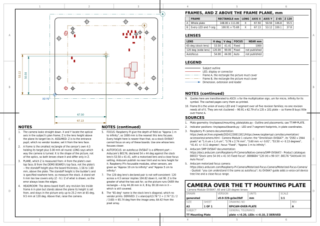
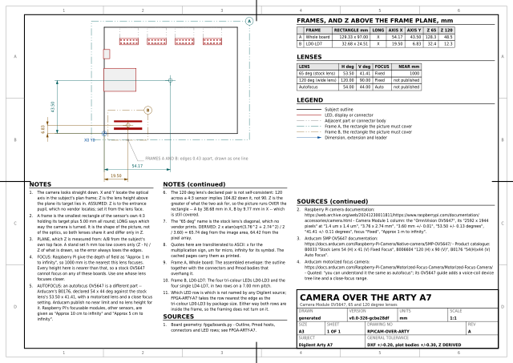
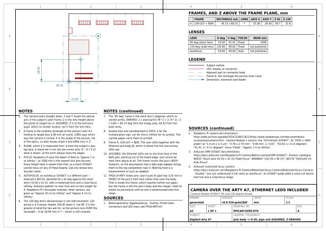
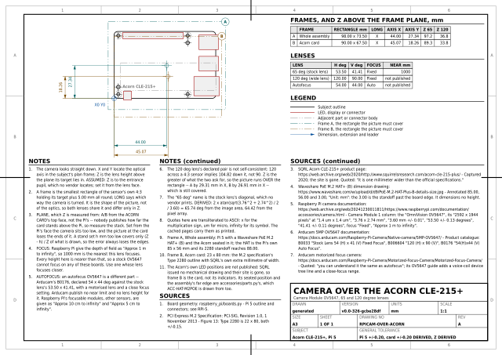

# Raspberry Pi camera modules

The camera boards, drawn for the thing that actually gets designed round them:
a mount with a light path through it. `RPICAM-2` and `RPICAM-3` mark the
board outline, the four mounting holes, the lens and sensor module with its
optical axis, and the camera FFC connector on the underside.

The four `RPICAM-OVER-*` sheets answer the other half of the same question.
Once the mount exists, how far above the board does it go, and over what
point? One sheet per subject, and each sheet's name says which after
`RPICAM-OVER-`: the Tiny Tapeout mounting plate, the Digilent Arty A7, the
Arty again with its Ethernet LEDs, and an Acorn CLE-215+. Each carries the
rectangle the picture has to cover, the plane the height is measured from,
and the height each lens needs.

| | |
|---|---|
| `boards.py` | **Generated.** Camera Module 2, and Camera Module 3 standard and wide |
| `extract.py` | Reads Raspberry Pi Ltd's own drawings and writes `boards.py` |
| `optics.py` | **Hand-written.** The OV5647's sensor, its two lenses and their focus, quoted from the vendors; the framing model; and the four subjects |
| `verify.py` | Checks every quote against the cached page, the model against Raspberry Pi's own figures, each lens's declared pair against the sensor's shape, and every frame against its target, its plane and its height |
| `output/` | `RPICAM-2` and `RPICAM-3` and the four `RPICAM-OVER-*` sheets, as SVG and PDF, and `raspberry-pi-camera-sheets.pdf`, the six bound into one document |

```sh
tools/fetch_raspberry_pi_camera.sh                    # once, needs network
uv run --no-project --with pdfplumber python raspberry_pi_camera/extract.py
uv run --no-project --with pillow python raspberry_pi_camera/verify.py
```

## The sheets

<!-- sheets:begin -->

Each thumbnail links to the PDF. The same sheet is also there as SVG.

<table>
<tr>
<td width="33%" valign="top" align="center">
<a href="output/cm2.pdf"></a><br>
<b>RPICAM-2</b> Raspberry Pi Camera Module 2<br>25 x 23.862 mm, Sony IMX219
</td>
<td width="33%" valign="top" align="center">
<a href="output/cm3.pdf"></a><br>
<b>RPICAM-3</b> Raspberry Pi Camera Module 3<br>25 x 23.862 mm, standard and wide, Sony IMX708
</td>
<td width="33%" valign="top" align="center">
<a href="output/over-tt-mounting-plate.pdf"></a><br>
<b>RPICAM-OVER-PLATE</b> Camera over the TT Mounting Plate<br>Camera Module OV5647, 65 and 120 degree lenses
</td>
</tr>
<tr>
<td width="33%" valign="top" align="center">
<a href="output/over-arty-a7.pdf"></a><br>
<b>RPICAM-OVER-ARTY</b> Camera over the Arty A7<br>Camera Module OV5647, 65 and 120 degree lenses
</td>
<td width="33%" valign="top" align="center">
<a href="output/over-arty-ethernet.pdf"></a><br>
<b>RPICAM-OVER-ETH</b> Camera over the Arty A7, Ethernet LEDs included<br>Camera Module OV5647, 65 and 120 degree lenses
</td>
<td width="33%" valign="top" align="center">
<a href="output/over-acorn-cle-215-plus.pdf"></a><br>
<b>RPICAM-OVER-ACORN</b> Camera over the Acorn CLE-215+<br>Camera Module OV5647, 65 and 120 degree lenses
</td>
</tr>
</table>

<!-- sheets:end -->

## Where the numbers come from

Three PDFs, all Raspberry Pi Ltd's, all vector, none of them a DXF:

| Sheet | Drawing | Published |
|---|---|---|
| `RPICAM-2` | [`camera-module-2-mechanical-drawing.pdf`](https://datasheets.raspberrypi.com/camera/camera-module-2-mechanical-drawing.pdf), title block **RASPBERRY PI CAMERA MODULE V2.1**, ref `RPI-CAM-V2_1` | dated 12/11/2015, drawn Mike Stimson, approved James Adams |
| `RPICAM-3` | [`camera-module-3-standard-mechanical-drawing.pdf`](https://datasheets.raspberrypi.com/camera/camera-module-3-standard-mechanical-drawing.pdf), `RP-008153-DS-1` | on the Product Information Portal, [Camera Module 3 design files](https://pip.raspberrypi.com/categories/1207-design-files) |
| `RPICAM-3` | [`camera-module-3-wide-mechanical-drawing.pdf`](https://datasheets.raspberrypi.com/camera/camera-module-3-wide-mechanical-drawing.pdf), `RP-008155-DS-1` | the same place |

## Neither plot is assumed to be 1:1

A PDF is CAD data only once you know what scale it was plotted at, so the
scale is *recovered* rather than assumed, the way `raspberry_pi/extract.py`
recovers the Pi 5's. Camera Module 3 turns out to be a true 1:1 plot; Camera
Module 2 turns out to be plotted at 1.5055.

The invariant is the mounting hole rectangle: 21 mm apart across the board,
12.5 mm apart up it, the lower pair 2 mm in from two edges. Finding it fixes
the origin, the orientation and the scale at once, and the two overall
dimensions the drawing prints are then required to come back out of it.

| | Recovered plot scale | Outline came back within |
|---|---|---|
| Camera Module 2 | **1.5055 : 1** | 0.031 mm of 25 x 23.862 |
| Camera Module 3 | **1.0000 : 1** | 0.004 mm of 25 x 23.862 |

The Camera Module 2 drawing is half again bigger than the part. A reader who
took the page at face value would get a 37.6 x 35.9 mm camera.

## What is machine-read and what is only printed

The two drawings are not equally readable, and the sheets say so.

- **Camera Module 3** carries its dimension text *as text*, and both
  drawings are checked, each against its own figures. Thirteen are on both --
  `25`, `23.862`, `12.5`, `14.5`, `14.4`, `10.8`, `8.9`, `ø2.2`, `ø4.75`,
  `1.12`, `2.75`, `5.71`, `19.61` -- the standard adds `ø5.75`, `11.3`,
  `6.98`, `66` and `41`, and the wide adds `ø6.95`, `12`, `8.3`, `102` and
  `67`. The comparison is against whole words, not a substring of the page:
  `12` is a figure the wide drawing prints on its own *and* the first half of
  the `12.5` both of them print. A transcription error fails the extraction
  rather than reaching a sheet.
- **Camera Module 2** carries none. `page.chars` is empty: every digit on it
  is a filled path. Its geometry is machine-read exactly as the other's is,
  but its printed dimensions are transcribed by eye, and the sheet carries a
  note saying that.

What was machine-read on each, in board coordinates (origin at the lower-left
corner, X across the 25 mm width, Y up the 23.862 mm height, viewed from the
lens side):

| | Camera Module 2 | Camera Module 3 |
|---|---|---|
| Outline | 25 x 23.862, R2.0 corners | the same |
| Mounting holes | ø2.2 at (2.00, 2.00), (22.98, 2.00), (2.00, 14.52), (22.98, 14.52) | ø2.2 with a ø4.75 land, at (2.00, 2.00), (23.00, 2.00), (2.00, 14.50), (23.00, 14.50) |
| Lens and sensor module | 8.45 x 8.49, centre (12.49, 14.40) | 10.80 x 10.80, centre (12.50, 14.40) |
| Clear aperture | not dimensioned | printed ø5.75 standard, ø6.95 wide; **drawn 5.750 and 7.000** |
| FFC connector, underside | 20.88 x 5.52, from the plan view | 19.61 x 5.71, from the two elevations |
| Board thickness | not stated | 1.12 |
| Height | **not stated anywhere on the drawing** | 11.3 standard, 12 wide, printed |

Raspberry Pi state that "board dimensions and mounting-hole positions for
Camera Module 3 are identical to Camera Module 2"
([camera.html, Advanced information](https://www.raspberrypi.com/documentation/accessories/camera.html)).
That is not taken on trust: each drawing is read on its own and the two hole
patterns compared. **They agree to 0.025 mm**, which is the plot noise of the
1.5:1 source, so the sheets may repeat the claim. The lens module is where the
two boards differ, and by the figures above it grew from 8.5 to 10.8 mm square
without its optical axis moving: 0.01 mm apart on two independent drawings.

## Where these drawings disagree with themselves

Worth knowing before designing to them. The Camera Module 3 drawing's side and
front elevations are 1:1 for the board section (1.120 drawn against 1.12
printed) and for the connector (2.750 against 2.75), but the lens stack is
drawn short: the printed 11.3 mm overall scales 10.08, and 6.98 above the
board scales 5.81. The wide drawing does the same, 12 printed against 10.93
drawn.

It is not only the heights. The **wide drawing's clear aperture is printed
`ø6.95` and drawn 7.000**, while the standard's `ø5.75` is drawn 5.750
exactly; the extractor measures the aperture on each drawing rather than
transcribing it, requires the two to stay within 0.2 mm, and prints both, and
`RPICAM-3` says both numbers. The High Quality Camera drawing does the same
thing again, `ø30.75` scaling 30.42 and `ø22.4` scaling 22.25 while its ø2.5
mounting holes scale 2.500 exactly.

The printed figures are the specification and the sheets quote them as
printed; the sheets do not dimension the height, because there is no view on
them to dimension it on and the source's own geometry would disagree with the
number.

## Where the camera goes

The four `RPICAM-OVER-*` sheets. No mechanical drawing carries a field of
view, a focal length or a focus range, so none of this comes off one. Every
figure below is quoted from the vendor that publishes it, and `verify.py`
reads the cached page back and fails if a quote is not in it.

Verbatim quotes below keep the vendor's own characters, degree signs and all;
everything outside them is ASCII, as the rest of this repository is.

### The sensor and the two lenses

Raspberry Pi's camera documentation, Camera Module 1 column
([cached snapshot](https://web.archive.org/web/20241230011811/https://www.raspberrypi.com/documentation/accessories/camera.html)):

| | Quoted |
|---|---|
| Sensor | `OmniVision OV5647` |
| Resolution | `2592 × 1944 pixels` |
| Sensor image area | `3.76 × 2.74 mm` |
| Pixel size | `1.4 µm × 1.4 µm` |
| Focal length | `3.60 mm +/- 0.01` |
| Horizontal field of view | `53.50 +/- 0.13 degrees` |
| Vertical field of view | `41.41 +/- 0.11 degrees` |
| Focus | `Fixed` |
| Depth of field | `Approx 1 m to ∞` |

Arducam's 5MP OV5647 documentation, from the product catalogue table headed
`Field of View(H x V) Focus Type`:

| SKU | Quoted |
|---|---|
| B0033, the standard module | `Stock Lens 54° (H) x 41° (V) Fixed Focus` |
| B006604, a wide one | `120°(H) x 90°(V)`, on an `M6 Lens`, fixed focus |
| B0176, the autofocus one | `54°(H)x44° (V) Auto Focus` |

Neither vendor says **how** the field of view is measured -- to which
rectangle, at what object distance, with or without distortion. That is not
left as a guess, because Raspberry Pi publish enough to settle it.

### The model is checked, not assumed

DERIVED, and checked by `verify.py`:

| | Arithmetic | Result | Declared |
|---|---|---|---|
| Active array | 2592 x 0.0014, 1944 x 0.0014 | 3.6288 x 2.7216 mm, 4:3 exactly | -- |
| Horizontal, from the array | 2 x atan(3.6288 / 2 / 3.60) | **53.496 deg** | 53.50 |
| Vertical, from the array | 2 x atan(2.7216 / 2 / 3.60) | **41.413 deg** | 41.41 |
| Horizontal, from the *image area* | 2 x atan(3.76 / 2 / 3.60) | 55.149 deg | 53.50 |
| Vertical, from the *image area* | 2 x atan(2.74 / 2 / 3.60) | 41.669 deg | 41.41 |

The declared angles come back out of the declared focal length and the
declared pixel count, to four thousandths of a degree on both axes, under a
plain rectilinear pinhole model measured **to the edge of the active pixel
array**. They do not come out of the "sensor image area" printed one row
above in the same table, which misses by 1.65 deg across and 0.26 down. So
the model these sheets use is the vendor's own, and the sheets can say so.
`verify.py` requires the array rows to match and the image-area rows not to.

### Where "65 degrees" comes from

No vendor prints it. It is the diagonal. DERIVED:

| From | Diagonal | |
|---|---|---|
| The image area, sqrt(3.76^2 + 2.74^2) = 4.652 | 2 x atan(4.652 / 2 / 3.60) = **65.74 deg** | which is the 65 |
| The active array, sqrt(3.6288^2 + 2.7216^2) = 4.536 | 2 x atan(4.536 / 2 / 3.60) = 64.42 deg | |

The sheets compute from the horizontal and vertical figures the vendors do
print, and say in a note what the 65 is.

### The 120 degree lens contradicts itself

DERIVED: on a 4:3 sensor a rectilinear lens has tan(V/2) = tan(H/2) x 3/4, so
120 deg across implies **104.82 deg** down, not the 90 deg Arducam declare.
The stock lens passes the same test to 0.01 deg (53.50 gives 41.42 against a
declared 41.41); the wide one is out by nearly fifteen degrees, so the two
figures cannot both be right. The sheets take the height as the greater of
what each declared angle asks for, which is the vertical every time, and say
by how much and on which axis the picture then runs over the rectangle drawn.

### Autofocus is a different part

Arducam's B0176 is an OV5647 with a motorised lens -- "Generally, you can
understand it the same as autofocus" -- and it is not the stock module with a
motor bolted on: its declared field of view is `54°(H)x44° (V)` against the
stock lens's `54° (H) x 41° (V)`, so the optics differ too. It needs a
voice-coil device tree line and gains a close-focus autofocus range; the two
strings Arducam's quick start shows are given there as run-together words in
the rendered page, so the forms to type are on
[that page](https://docs.arducam.com/Raspberry-Pi-Camera/Motorized-Focus-Camera/Quick-Start-Guide/OV5647-Motorized-Focus-Camera/)
rather than transcribed here.

What Arducam do **not** publish for it: a lens height, a focus range in
millimetres, or a minimum object distance. So no height on any of these
sheets is worked out from the autofocus variant. The only published close
limits for any Raspberry Pi camera are on other sensors -- `Approx 10 cm to
∞` for the IMX219 and the IMX708, `Approx 5 cm to ∞` for the IMX708 wide --
and they are quoted to say what order of distance a focusable module reaches,
not as an OV5647 figure.

### The result, and the problem with it

A frame is the smallest rectangle of the sensor's own 4:3, in whichever of
the two orientations is smaller, holding its target plus **5.00 mm on every
side**. Five flat rather than a percentage: what a hand-aimed stand has to
absorb is where the stand ends up, which does not scale with the thing being
framed, and ten per cent round the Arty's LED row would be 0.36 mm, under the
board data's own tolerance.

**Z is measured from the plane the frame's target lies in**, which is not
always the subject's own top face; the column below says which. A stand set
h mm below the right plane covers only (Z - h) / Z of the rectangle at it, so
the error always loses the edges.

| Sheet | Frame | Rectangle, mm | Z from | 65 deg | 120 deg |
|---|---|---|---|--:|--:|
| `RPICAM-OVER-PLATE` | The whole plate | 148.00 x 111.00 | the plate face | 146.8 | 55.5 |
| `RPICAM-OVER-PLATE` | Every LED and 7-seg | 100.91 x 75.69 | the demo board's top face | 100.1 | 37.8 |
| `RPICAM-OVER-ARTY` | The whole Arty | 129.33 x 97.00 | the board face | 128.3 | 48.5 |
| `RPICAM-OVER-ARTY` | LD0-LD7 | 32.68 x 24.51 | the board face | 32.4 | 12.3 |
| `RPICAM-OVER-ETH` | LD0-LD7 and the RJ45 | 45.15 x 60.21 | the board face | 59.7 | 22.6 |
| `RPICAM-OVER-ACORN` | The whole assembly | 98.00 x 73.50 | the Acorn card's top face | 97.2 | 36.8 |
| `RPICAM-OVER-ACORN` | The Acorn card | 90.00 x 67.50 | the Acorn card's top face | 89.3 | 33.8 |

**Every one of those heights is inside the stock lens's minimum focus
distance.** Raspberry Pi give the Camera Module 1's focus as `Fixed` and its
depth of field as `Approx 1 m to ∞`; the largest height here, 146.8 mm, is a
seventh of that metre, and the smallest, 12.3 mm, is an eightieth. A stock
Camera Module OV5647 cannot focus on any of these boards. Every sheet says so
in its notes, and `verify.py` checks the verdict against the arithmetic for
every height that has a published limit to check against -- which is the
seven at 65 deg. Arducam publish no near limit for the wide lens at all, so
its seven are reported as unknown rather than passed or failed.

That is the useful finding, and it is a mount decision: a rig built to these
sheets needs an adjustable-focus or motorised OV5647, not the stock one.

### What the sheets assume

- **Z is to the lens's entrance pupil**, and neither vendor says where that
  sits behind the front element. On a 3.60 mm lens it is within a few
  millimetres of it. Set Z from the lens face and treat it as good to a few
  millimetres, no better. ASSUMED, and on every sheet.
- **The plate-to-board offset on `RPICAM-OVER-PLATE` is the
  builder's.** Frame B is set from the demo board's top face, and getting
  there from the plate means the standoff height plus the board thickness.
  The thickness is each
  revision's own board file, 1.56 to 1.60 mm; the standoff height is
  specified nowhere in this repository, so the sheet says to measure the
  stack rather than adding a figure from here. Frame A is set from the plate
  face, and the sheet prints how far a board may stand above it before its
  own outline leaves the picture: 25.2 mm at 65 deg, 9.5 mm at 120 deg.
- **The Pi-to-card stack on `RPICAM-OVER-ACORN` is
  unpublished.** Waveshare dimension no height on their drawing and
  `accessories/parts.py` carries none either, so both frames are set from
  the card's own top face -- the highest plane either target reaches, so
  everything below it is covered by more than the frame. Measure the stack.
  A stand set from the Pi's face instead sits too low and loses the ends of
  the card.
- **The Arty's Ethernet LEDs are on the front face of the jack** and cannot
  be seen from above at all. `RPICAM-OVER-ETH`'s frame covers
  the jack's *body* footprint, on the assumption that a light pipe adapter
  brings them to the top somewhere near it. `FPGA-LP-ARTY`
  draws one, and its pipe tips land 5.01 mm in *front* of the jack's face
  rather than over the body. Measured from the board edge that is 5.11 mm
  past it, inside a frame that reaches 7.28 mm past it -- 5.00 mm of margin
  out from the jack body's own front edge, plus 2.04 mm of 4:3 expansion --
  so the frame is loose rather than wrong. Nothing on that sheet is a
  measurement of the adapter. ASSUMED, and `TODO.md` carries tightening it.
- **The Acorn's own LED positions are not published.** SQRL issued no
  mechanical drawing and their site is gone, so the second frame on
  `RPICAM-OVER-ACORN` is the card, not its indicators.

### Where each subject's geometry comes from

Nothing is restated that some family already extracted:

| Subject | From |
|---|---|
| TT mounting plate | [`tinytapeout/mounting_plate/plate.py`](../tinytapeout/mounting_plate/README.md) for the outline, [`tinytapeout/boards.py`](../tinytapeout/README.md) for every revision's LEDs, 7-segment displays, board outlines and thicknesses, moved into plate coordinates by the placement offsets |
| Arty A7 | [`fpga/boards.py`](../fpga/README.md), which is Digilent's own DXF and PDF plot |
| Acorn assembly | [`raspberry_pi/boards.py`](../raspberry_pi/README.md) for the Pi 5, and [`accessories/parts.py`](../accessories/README.md) for the card, where it sits and the HAT it sits in |

The Acorn is no exception either. Its card is the PCI Express M.2
specification's Type 2280 outline, 22 x 80 mm, widened by the one millimetre
SQRL's own product page claims ("it is one millimeter wider than the official
specifications", [Internet Archive, 2020](https://web.archive.org/web/2020/http://www.squirrelsresearch.com/acorn-cle-215-plus/));
that rectangle, where it is seated, the HAT's own width and how far its 2280
standoff reaches past the board edge are all `accessories/parts.py`'s, which
`ACC-HAT-M2POE` is drawn from as well, so the card on that sheet and the card
on this one cannot drift apart. The assembly's 88.00 mm far edge falls out of
this repository's own Pi 5 data and that standoff.

## What is not here, and why

**Camera Module 1, the OV5647 board.** There is no official Raspberry Pi
mechanical drawing for it, and there never was. It has no category on the
Product Information Portal -- the peripherals index lists Camera Module 2,
Camera Module 3, the High Quality Camera and the Global Shutter Camera and
nothing earlier -- `datasheets.raspberrypi.com/camera/` has never served one,
and the archived `raspberrypi.org/documentation/hardware/camera/mechanical/`
directory held drawings for the v2 camera and the HQ camera only. The
documentation gives "around 25 × 24 × 9 mm" in a product table, which is a
product table and not a drawing. Rather than draw a sheet from a specification
table, the board is left out. Its *optics* are another matter, and they are
here: `optics.py` and the four `RPICAM-OVER-*` sheets are about the OV5647's
field of view and focus, for which Raspberry Pi and Arducam both publish
figures. A third-party module's own board outline is still somebody else's
part with somebody else's drawing, and belongs to whoever draws it.

**The High Quality Camera.** Its drawing *does* exist and was read --
[`RP-008200-DS-1`, hq-camera-cs-mechanical-drawing](https://pip.raspberrypi.com/documents/RP-008200-DS),
a 2.34618:1 plot on A4 landscape, with a live text layer. Machine-read from
it: a 38 x 38 mm outline; four ø2.5 holes 4.04 mm in from each corner, 29.94
apart; the 8.5 mm sensor square on the board centre; the C/CS lens mount as
`ø30.75` over an `ø22.4` aperture inside a knurled `ø36` ring drawn scalloped
between 35.38 and 38.00; and a tripod boss centred on the lower edge and
reaching 11.35 mm below it, printed `13.97` across where the drawing draws
13.86. The thread is *not* on that drawing: `1/4–20 UNC` appears in the
separate CS/M12 mount document,
[`RP-008201-DS-1`](https://pip.raspberrypi.com/documents/RP-008201-DS),
published February 2025, whose physical-specification page redraws both
mounts at a reduced scale. The camera has no sheet here for two
reasons, both about the source and the renderer rather than about the camera:
`board_sheet.render_board` draws every scheduled feature as a rectangle, and a
ø36 knurled ring drawn as a square is a worse drawing than none; and the
drawing never locates the FFC connector in plan at all -- it appears only in
the side elevation, as a 5.71 x 2.75 section -- so one of the five things
these sheets exist to mark cannot be marked. `TODO.md` carries it.

**The sensor module's lower body, as a scheduled feature.** It was
considered and left out. On both boards the module has a body below the lens
housing that reaches toward the lower edge -- stepped on the Camera Module 2,
notched on the Camera Module 3 -- and it is raised material a mount has to
clear, so it is not nothing. But a `Feature` is a bounding box, and a
schedule entry reading "6.72 to 16.14" for a shape with a step in it would be
a precise-looking figure that is wrong at the corner it omits. Both sheets
carry its extents in a note instead, where prose can say "stepped", and both
say where they came from. Drawing it properly needs a feature that is a
profile rather than a box, which is the same change the High Quality Camera
wants; `TODO.md` carries that one.

**The Global Shutter Camera and the AI Camera.** Drawings exist
([`RP-008195-DS`](https://pip.raspberrypi.com/documents/RP-008195-DS) for the
GS Camera); neither was asked for and neither is drawn.

**The Camera Module 3 STEP model.**
[`camera-module-3-step.zip`](https://datasheets.raspberrypi.com/camera/camera-module-3-step.zip)
is published and was not used. The drawing is a true 1:1 plot with a live text
layer and gives everything these sheets need; a 10 MB assembly would be a
second source for the same numbers.

## Feature numbers

Fixed across the family, as they are on the Raspberry Pi sheets: **1** is the
lens and sensor module and **2** is the camera FFC connector, on every sheet.
